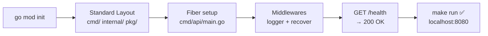
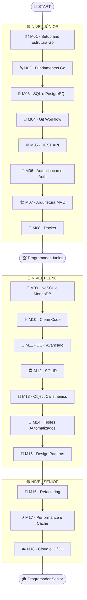
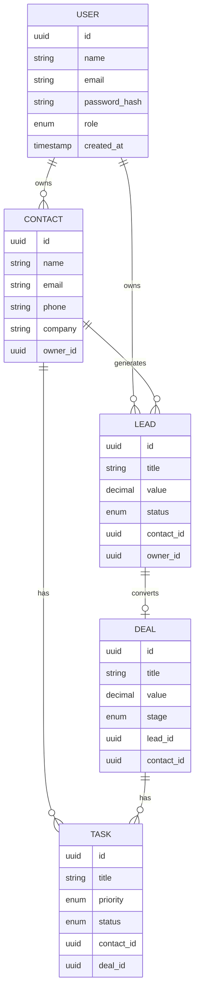
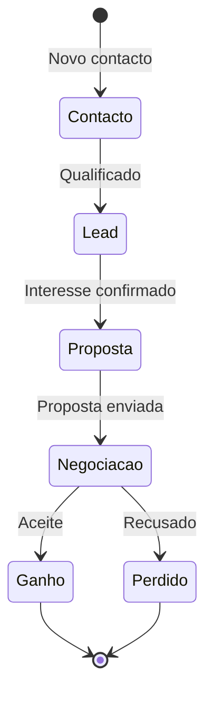
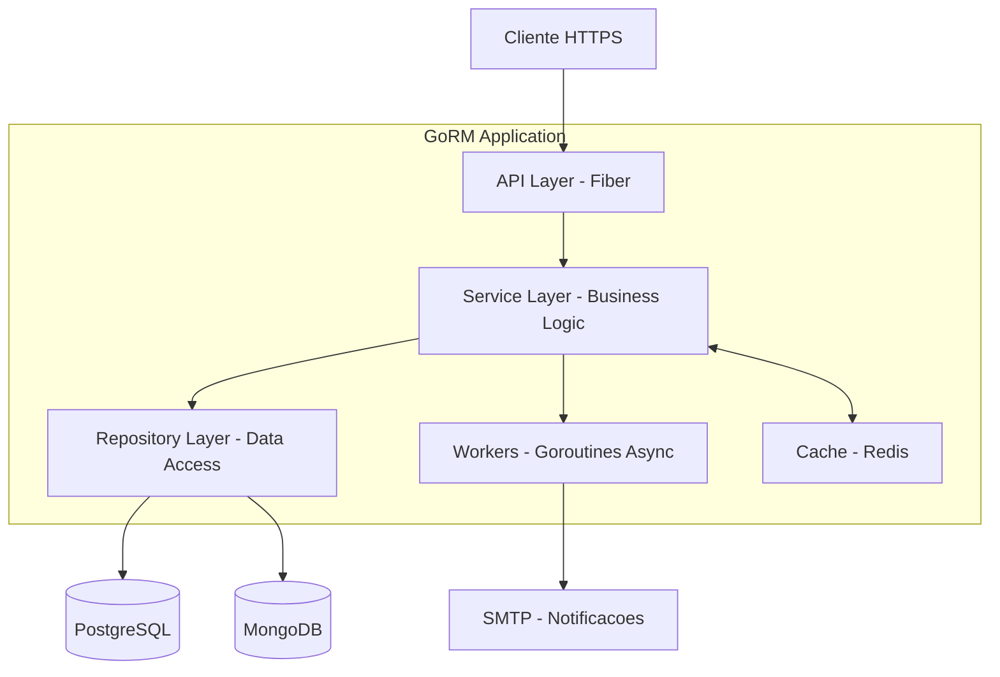
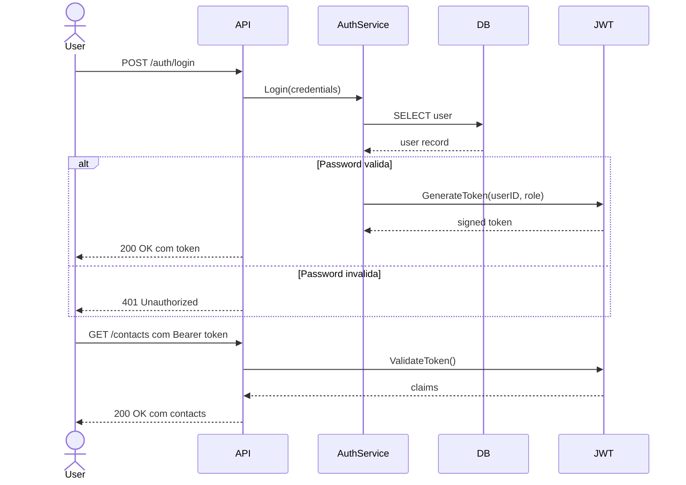
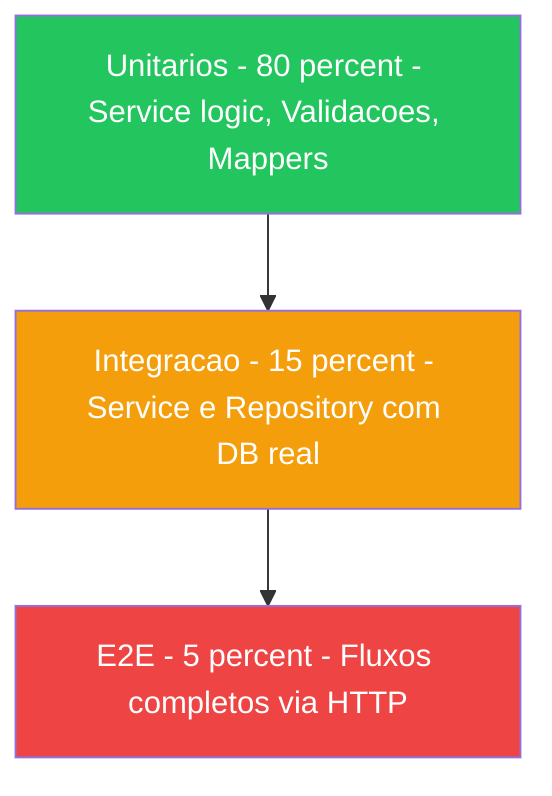
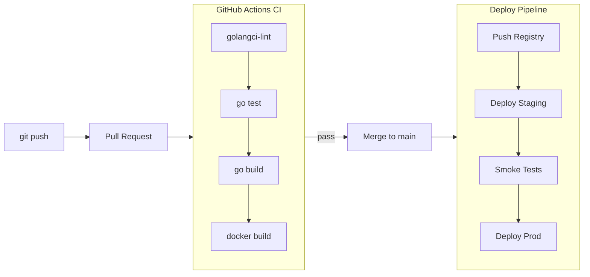

# 🚀 GoRM — Um CRM construído em Go

> **Curso de backend com didática de autoconstrução.**
> Cada branch Git = 1 módulo de aprendizagem. Do zero ao deploy, do Júnior ao Sénior.

---

## 📦 Módulo 01 — Setup & Estrutura Go

> **Branch:** `branch-01-setup` | **Nível:** 🟢 Júnior | **Duração:** ~3 dias

### O que vais aprender

- Como estruturar um projeto Go com o Standard Layout
- O que são módulos Go (`go.mod`, `go.sum`)
- Como criar um servidor HTTP com Fiber
- Como organizar middlewares e error handling global
- Makefile para produtividade no dia-a-dia

### O que foi construído neste módulo

- `GET /health` — endpoint de saúde da app
- Error handler global que mapeia erros de domínio para HTTP
- Middleware de logging estruturado
- Package `pkg/logger` com `slog` (stdlib Go 1.21+)
- Makefile com comandos: `run`, `build`, `test`, `lint`, `tidy`

### Contexto no GoRM



---

[](https://golang.org)
[](LICENSE)
[](docs/)

---

## 📖 O que é este repositório?

**GoRM** é simultaneamente um **curso de backend em Go** e uma **aplicação CRM real e funcional**.

A ideia é simples: **aprendes construindo**. Cada branch representa uma etapa de aprendizagem — fazes `git checkout` e estás imediatamente no contexto certo, com código funcional, documentação e desafios práticos.

No final, tens um CRM completo deployado, testado e documentado.

---

## 🗺️ Mapa do Curso



---

## 🌿 Navegação por Branches

```bash
git clone https://github.com/titi-byte-dev/gorm-crm.git
cd gorm-crm

# Navega para qualquer módulo
git checkout branch-01-setup
git checkout branch-05-rest-api
git checkout branch-12-solid
```

| Branch | Módulo | Nível | Feature no GoRM |
|--------|--------|-------|-----------------|
| `branch-01-setup` | Setup e Estrutura | 🟢 Junior | Projeto inicializado, `GET /health` |
| `branch-02-go-fundamentos` | Fundamentos Go | 🟢 Junior | Domain models definidos |
| `branch-03-sql` | SQL e PostgreSQL | 🟢 Junior | CRUD de Contactos |
| `branch-04-git-workflow` | Git Workflow | 🟢 Junior | Branching strategy |
| `branch-05-rest-api` | REST API | 🟢 Junior | API REST completa |
| `branch-06-auth` | Autenticacao | 🟢 Junior | JWT + RBAC |
| `branch-07-mvc-layers` | Arquitetura MVC | 🟢 Junior | Camadas separadas |
| `branch-08-docker` | Docker | 🟢 **→ Junior** | App containerizada |
| `branch-09-nosql` | NoSQL e MongoDB | 🔵 Pleno | Activity logs |
| `branch-10-clean-code` | Clean Code | 🔵 Pleno | Codebase refatorada |
| `branch-11-oop` | OOP Avancado | 🔵 Pleno | Interfaces avancadas |
| `branch-12-solid` | SOLID | 🔵 Pleno | SOLID aplicado |
| `branch-13-calisthenics` | Object Calisthenics | 🔵 Pleno | Regras aplicadas |
| `branch-14-testes` | Testes | 🔵 Pleno | Unit + Integration + E2E |
| `branch-15-patterns` | Design Patterns | 🔵 Pleno | 10+ patterns aplicados |
| `branch-16-refactoring` | Refactoring | 🟣 Senior | Tecnicas avancadas |
| `branch-17-performance` | Performance e Cache | 🟣 Senior | Redis + Jobs async |
| `branch-18-cloud-cicd` | Cloud e CI/CD | 🟣 **→ Senior** | Deploy + Pipeline |

---

## 🏗️ Modelo de Dados



---

## 🔄 Pipeline de Vendas



---

## 🏛️ Arquitetura Final



---

## 🔐 Fluxo de Autenticacao



---

## 🧪 Piramide de Testes



---

## ⚙️ CI/CD Pipeline



---

## 📁 Estrutura de Pastas

```
gorm-crm/
├── cmd/api/main.go
├── internal/
│   ├── contact/        # Handler · Service · Repository · Model · DTO
│   ├── lead/
│   ├── deal/
│   ├── task/
│   ├── auth/           # JWT · Middleware · RBAC
│   └── shared/         # Errors · Events · Utils
├── pkg/
│   ├── database/
│   ├── cache/
│   └── logger/
├── migrations/
├── docs/               # Diagramas e ADRs
├── tests/
│   ├── unit/
│   ├── integration/
│   └── e2e/
├── docker-compose.yml
├── Dockerfile
├── Makefile
└── .github/workflows/ci.yml
```

---

## 🛠️ Stack

| Camada | Tecnologia |
|--------|-----------|
| Linguagem | Go 1.22+ |
| HTTP Framework | Fiber |
| ORM | GORM + golang-migrate |
| Base de dados | PostgreSQL |
| Logs / Historico | MongoDB |
| Cache | Redis |
| Auth | JWT (golang-jwt) |
| Containers | Docker + Docker Compose |
| CI/CD | GitHub Actions |
| Cloud | AWS / GCP |
| Testes | testify + testcontainers |

---

## 🚦 Como Comecar

```bash
git clone https://github.com/titi-byte-dev/gorm-crm.git
cd gorm-crm
git checkout branch-01-setup
cat README.md
make run
curl http://localhost:8080/health
```

---

## 📋 Checklist por Modulo

- [ ] README.md com objetivo claro
- [ ] Diagrama Mermaid de contexto
- [ ] Codigo Go funcional e testavel
- [ ] Testes (a partir do M03)
- [ ] CHALLENGE.md com exercicio pratico
- [ ] ADR se houve decisao de design
- [ ] git tag no final do modulo

---

## 📜 Licenca

MIT © [titi-byte-dev](https://github.com/titi-byte-dev)

---

> *"O melhor codigo e o codigo que tu proprio construiste, entendes e consegues explicar."*
