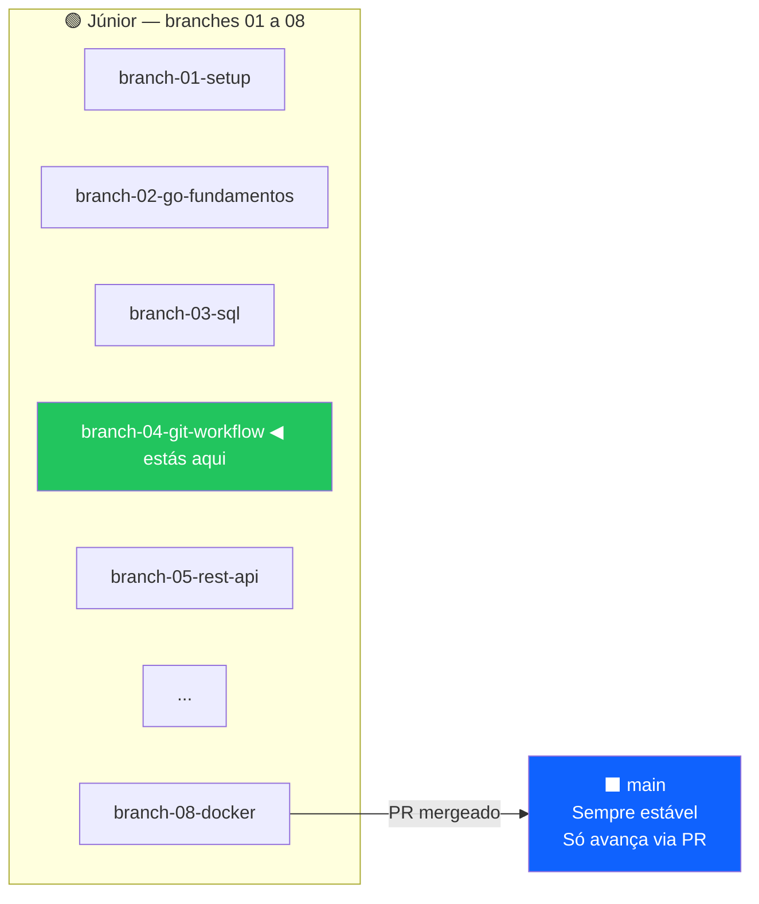
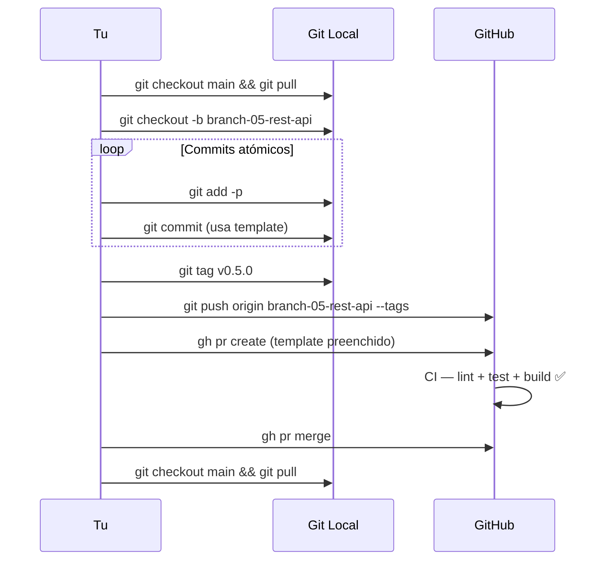

<!-- NAVIGATION BAR -->
<div align="center">

**[⬅️ M03 — SQL & PostgreSQL](https://github.com/titi-byte-dev/gorm-crm/tree/branch-03-sql)** &nbsp;|&nbsp;
`branch-04-git-workflow` &nbsp;|&nbsp;
**[M05 — REST API ➡️](https://github.com/titi-byte-dev/gorm-crm/tree/branch-05-rest-api)**

`████░░░░░░░░░░░░░░░░` Módulo **04 / 18** — Nível 🟢 Júnior

</div>

---

# 🌿 Módulo 04 — Git Workflow

[](https://github.com/titi-byte-dev/gorm-crm/actions/workflows/ci.yml)
[](https://golang.org)
[](.)

> **O que foi construído:** O próprio workflow que usas neste curso — branching strategy, conventional commits, PR template e o commit message template. Este módulo documenta e formaliza o que já estamos a fazer.

---

## 🎯 Objetivos de Aprendizagem

Ao terminar este módulo consegues:

- [ ] Explicar a estratégia de branches deste projeto e porquê
- [ ] Escrever commits no formato Conventional Commits
- [ ] Usar `git add -p` para commits atómicos e limpos
- [ ] Criar e navegar PRs com template estruturado
- [ ] Configurar e usar o commit message template

---

## ⚡ Começa já

```bash
git checkout branch-04-git-workflow

# Configura o repositório (commit template + outros)
make setup
```

---

## 🗺️ Estrutura de Branches do Curso



---

## 📝 Conventional Commits — Referência Rápida

```
<tipo>(<escopo>): <o quê, imperativo, max 72 chars>

[porquê — só quando não é óbvio]
```

<details>
<summary><strong>Ver: exemplos reais do GoRM</strong></summary>

```bash
# ✅ Bons commits — descrevem o quê + porquê quando necessário
feat(contact): add ILIKE search with trigram index

fix(auth): invalidate refresh token on logout

Tokens persisted after logout, allowing session reuse.
Added Redis blacklist with TTL matching token expiry.

refactor(deal): move stage validation to domain model

Validation was scattered across handler and service.
CanTransitionTo() now lives in Deal.Stage — single source of truth.

docs(m04): add git workflow guide and commit template

chore: upgrade fiber v2.52.6 → v2.52.13 (CVE-2024-XXXX)

# ❌ Commits vagos — não descrevem o quê nem o porquê
fix: bug
update stuff
wip
changes
```

</details>

---

## 🔍 `git add -p` — O Hábito Mais Importante

> [!TIP]
> Em vez de `git add .` (adiciona tudo), usa `git add -p` para rever e adicionar **por hunks**. Cada commit fica atómico — uma mudança, uma razão.

```bash
git add -p

# Para cada hunk, o Git pergunta:
# Stage this hunk [y,n,q,a,d,/,s,?,e]?
# y — sim, adicionar
# n — não
# s — dividir em hunks menores
# e — editar manualmente o hunk
```

<details>
<summary><strong>Ver: exemplo de sessão git add -p</strong></summary>

```diff
# Tens dois tipos de mudança no mesmo ficheiro:
# 1. Nova feature (queres commitar)
# 2. Comentário que adicionaste a testar (não queres)

@@ -45,6 +45,12 @@ func (s *ContactService) Create(...) {
+   // TODO: remover este log de debug
+   fmt.Println("debug:", contact)
+
    saved, err := s.repo.Save(contact)

# → respondes "n" a este hunk

@@ -58,6 +64,8 @@ func (s *ContactService) Create(...) {
+   s.bus.Publish(events.Event{
+       Type:    events.ContactCreated,
+       Payload: saved,
+   })

# → respondes "y" a este hunk
```

Resultado: o commit só inclui o event publishing, não o debug print.

</details>

---

## 🔄 Fluxo Completo de um Módulo



---

## 📁 Ficheiros deste módulo

```
Criados:
├── .gitmessage                    ← template de commit (ativa com make setup)
├── docs/git-workflow.md           ← guia de referência completo
└── docs/adr/007-git-workflow.md   ← decisão de design documentada

Modificados:
└── Makefile                       ← make setup · make db/up · make db/down
```

---

## 🎯 Desafio

Ver [CHALLENGE.md](CHALLENGE.md)

- **Nível 1** — Ativa o template e faz um commit usando `git commit` (sem `-m`)
- **Nível 2** — Usa `git add -p` para separar duas mudanças em dois commits distintos
- **Nível 3** — Cria uma branch de desafio, resolve o Challenge do M03, abre um PR

---

## ✅ Checklist antes de avançar

- [ ] `make setup` corrido — commit template ativo
- [ ] Entendes a diferença entre `git add .` e `git add -p`
- [ ] Consegues explicar o formato Conventional Commits
- [ ] Sabes navegar entre branches e ver diffs entre módulos

---

<!-- NAVIGATION BAR BOTTOM -->
<div align="center">

**[⬅️ M03 — SQL & PostgreSQL](https://github.com/titi-byte-dev/gorm-crm/tree/branch-03-sql)** &nbsp;|&nbsp;
`04 / 18` &nbsp;|&nbsp;
**[M05 — REST API ➡️](https://github.com/titi-byte-dev/gorm-crm/tree/branch-05-rest-api)**

</div>
