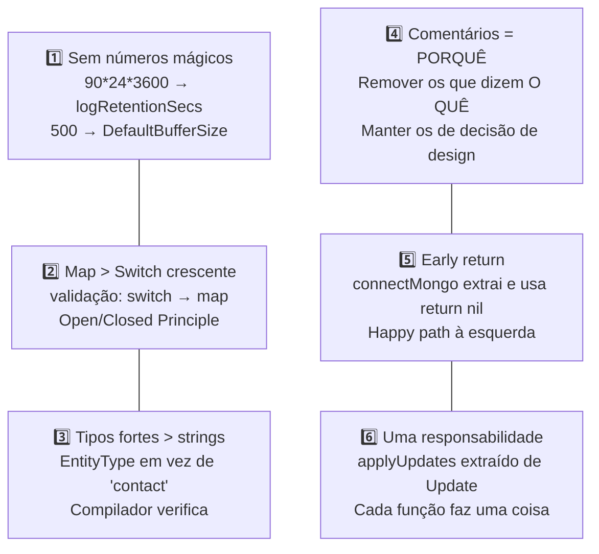

<!-- NAVIGATION BAR -->
<div align="center">

**[⬅️ M09 — NoSQL](https://github.com/titi-byte-dev/gorm-crm/tree/branch-09-nosql)** &nbsp;|&nbsp;
`branch-10-clean-code` &nbsp;|&nbsp;
**[M11 — OOP Avançado ➡️](https://github.com/titi-byte-dev/gorm-crm/tree/branch-11-oop)**

`██████████░░░░░░░░░░` Módulo **10 / 18** — Nível 🔵 Pleno

</div>

---

# ✨ Módulo 10 — Clean Code Principles

[](https://github.com/titi-byte-dev/gorm-crm/actions/workflows/ci.yml)
[](https://golang.org)
[](.)

> **O que foi construído:** Nenhuma feature nova. Zero comportamento alterado. O código ficou mais claro, mais seguro em compile-time e mais fácil de manter — aplicando 6 princípios Clean Code a smells reais encontrados no GoRM.

---

## 🎯 Objetivos de Aprendizagem

Ao terminar este módulo consegues:

- [ ] Identificar números mágicos e substituí-los por constantes nomeadas
- [ ] Distinguir comentários úteis (o PORQUÊ) dos redundantes (o QUÊ)
- [ ] Usar tipos fortes em vez de strings para valores enumerados
- [ ] Aplicar early return para reduzir nesting
- [ ] Extrair funções pequenas com uma única responsabilidade

---

## ⚡ Começa já

```bash
git checkout branch-10-clean-code

# Vê o que mudou — cada commit é um princípio
git log --oneline branch-09-nosql..branch-10-clean-code

# Compara um ficheiro antes e depois
git diff branch-09-nosql..branch-10-clean-code -- internal/contact/service.go
```

---

## 🗺️ Os 6 Princípios Aplicados



---

## 🔍 Exemplo mais impactante — tipos fortes

> [!IMPORTANT]
> Mudar `string` para `EntityType` parece cosmético mas tem consequências reais.

```go
// ❌ Antes — typo passa no compilador, falha em runtime
repo.FindByEntity("contcat", id, 50)  // silencioso, devolve vazio

// ✅ Depois — erro de compilação imediato
repo.FindByEntity(EntityContcat, id, 50)
// → undefined: EntityContcat  ← o compilador encontra antes de correr
```

---

## 📖 Documento de referência

Ver [`docs/clean-code-examples.md`](docs/clean-code-examples.md) — todos os 6 princípios com código real antes/depois, regra de aplicação e quando usar.

---

## 🎯 Desafio

Ver [CHALLENGE.md](CHALLENGE.md)

- **Nível 1** — Encontra mais 2 números mágicos no codebase e substitui por constantes
- **Nível 2** — Encontra um comentário que explica O QUÊ e tenta renomear o código para torná-lo desnecessário
- **Nível 3** — Aplica early return a uma função no codebase que ainda usa if/else aninhado

---

## ✅ Checklist antes de avançar

- [ ] `git log --oneline branch-09-nosql..branch-10-clean-code` — leste todos os 7 commits?
- [ ] Consegues explicar a diferença entre um comentário PORQUÊ e um comentário QUÊ?
- [ ] Sabes porque `EntityType` é mais seguro que `string` para valores enumerados?
- [ ] Leste `docs/clean-code-examples.md` com os antes/depois?

---

<!-- NAVIGATION BAR BOTTOM -->
<div align="center">

**[⬅️ M09 — NoSQL](https://github.com/titi-byte-dev/gorm-crm/tree/branch-09-nosql)** &nbsp;|&nbsp;
`10 / 18` &nbsp;|&nbsp;
**[M11 — OOP Avançado ➡️](https://github.com/titi-byte-dev/gorm-crm/tree/branch-11-oop)**

</div>
