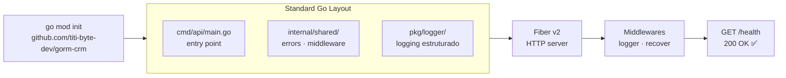
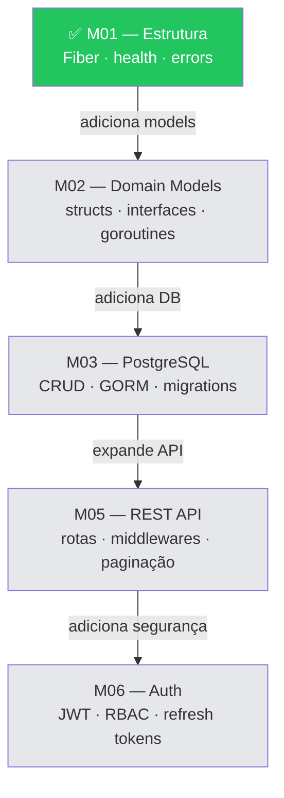

<!-- NAVIGATION BAR -->
<div align="center">

**[⬅️ Início](https://github.com/titi-byte-dev/gorm-crm/tree/main)** &nbsp;|&nbsp;
`branch-01-setup` &nbsp;|&nbsp;
**[M02 — Fundamentos Go ➡️](https://github.com/titi-byte-dev/gorm-crm/tree/branch-02-go-fundamentos)**

`█░░░░░░░░░░░░░░░░░░` Módulo **01 / 18** — Nível 🟢 Júnior

</div>

---

# 📦 Módulo 01 — Setup & Estrutura Go

[](https://github.com/titi-byte-dev/gorm-crm/actions/workflows/ci.yml)
[](https://golang.org)
[](https://gofiber.io)
[](LICENSE)
[](.)

> **O que vais construir:** O esqueleto do GoRM CRM — projeto Go inicializado, servidor HTTP a correr e o primeiro endpoint funcional (`GET /health`).

---

## 🎯 Objetivos de Aprendizagem

Ao terminar este módulo consegues:

- [ ] Explicar a estrutura `cmd/`, `internal/`, `pkg/` e porquê existe
- [ ] Criar e configurar um módulo Go (`go.mod`)
- [ ] Montar um servidor HTTP com Fiber com middlewares básicos
- [ ] Separar error handling numa camada dedicada
- [ ] Usar um `Makefile` para automatizar tarefas comuns

---

## ⚡ Começa já

```bash
git checkout branch-01-setup
make run
```

```bash
# Noutro terminal
curl http://localhost:8080/health
# → {"service":"gorm-crm","status":"ok","version":"0.1.0"}
```

> [!TIP]
> Não tens o `make`? Corre `go run ./cmd/api/main.go` diretamente.

---

## 🗺️ O que foi construído



---

## 📁 Ficheiros deste módulo

<details>
<summary><strong>Ver estrutura completa de pastas</strong></summary>

```
gorm-crm/
├── cmd/
│   └── api/
│       └── main.go              ← Entry point: Fiber + routes + error handler
│
├── internal/
│   └── shared/
│       ├── errors/
│       │   └── errors.go        ← Sentinel errors + HTTP error handler global
│       └── middleware/
│           └── logger.go        ← Middleware de logging estruturado
│
├── pkg/
│   └── logger/
│       └── logger.go            ← slog: JSON em produção, texto em desenvolvimento
│
├── Makefile                     ← run · build · test · lint · tidy
├── .env.example                 ← Variáveis de ambiente (todas as futuras incluídas)
└── go.mod / go.sum              ← Módulo Go + dependências
```

</details>

---

## 🔍 Walkthrough do Código

### `cmd/api/main.go` — O ponto de entrada

> [!NOTE]
> Em Go, `main.go` dentro de `cmd/api/` separa o executável da lógica reutilizável. Se quiseres um segundo executável (ex: um CLI), crias `cmd/cli/main.go` sem duplicar código.

```go
app := fiber.New(fiber.Config{
    AppName:      "GoRM CRM v0.1.0",
    ErrorHandler: errors.Handler,   // ← centraliza todo o error handling
})

app.Use(recover.New())              // ← recupera de panics sem crashar
app.Use(logger.New(...))            // ← loga cada request automaticamente
```

---

### `internal/shared/errors/errors.go` — Erros como valores

> [!IMPORTANT]
> Go não tem exceções. Erros são **valores de retorno** — esta é uma das diferenças mais importantes para quem vem de outras linguagens. Este ficheiro define os erros de domínio do GoRM e o mapeamento para códigos HTTP.

```go
var (
    ErrNotFound     = errors.New("not found")      // → HTTP 404
    ErrUnauthorized = errors.New("unauthorized")   // → HTTP 401
    ErrForbidden    = errors.New("forbidden")      // → HTTP 403
    ErrConflict     = errors.New("conflict")       // → HTTP 409
    ErrValidation   = errors.New("validation error") // → HTTP 422
)
```

**Padrão de uso** (nos módulos seguintes):
```go
// No service — devolve erro de domínio
func (s *ContactService) GetContact(id uuid.UUID) (*Contact, error) {
    contact, err := s.repo.FindByID(id)
    if err != nil {
        return nil, fmt.Errorf("get contact: %w", ErrNotFound)
    }
    return contact, nil
}

// No handler — não precisa saber o código HTTP
// O ErrorHandler global trata disso
```

---

### `pkg/logger/logger.go` — Logging estruturado

> [!NOTE]
> `slog` é parte da stdlib desde Go 1.21. Em desenvolvimento, devolve texto legível. Em produção, devolve JSON que sistemas como Datadog/Loki conseguem indexar.

```go
// Desenvolvimento
handler = slog.NewTextHandler(os.Stdout, ...)
// → time=2026-06-01T10:00:00Z level=DEBUG msg="server started" port=8080

// Produção
handler = slog.NewJSONHandler(os.Stdout, ...)
// → {"time":"2026-06-01T10:00:00Z","level":"INFO","msg":"server started","port":8080}
```

---

## 🧠 Conceitos-Chave

<details>
<summary><strong>Standard Go Layout — porquê esta estrutura?</strong></summary>

```
cmd/        → executáveis (um por subpasta)
internal/   → código privado — só importável dentro deste módulo Go
pkg/        → código reutilizável — pode ser importado por outros projetos
```

A pasta `internal/` é **reforçada pelo compilador Go** — se um projeto externo tentar importar algo de `internal/`, o build falha. Isto garante que as abstrações internas não "vazam" para fora.

</details>

<details>
<summary><strong>Porque Fiber e não net/http nativo?</strong></summary>

Ver [ADR-001](docs/adr/001-http-framework.md) para a decisão completa.

Resumo: Fiber tem API familiar (similar a Express), alta performance, e permite ao estudante focar na lógica Go sem boilerplate HTTP. No módulo de performance (M17) analisamos o custo desta abstração.

</details>

<details>
<summary><strong>O que é o Makefile e porquê usar?</strong></summary>

```makefile
make run        → go run ./cmd/api/main.go
make build      → compila o binário em bin/
make test       → go test -v -race ./...
make lint       → golangci-lint run ./...
make tidy       → go mod tidy
```

`.PHONY` diz ao Make que estes targets não são ficheiros — sem isso, se existir um ficheiro chamado `run`, o Make ignora o comando.

</details>

---

## 🔄 O que muda nos módulos seguintes



---

## 🎯 Desafio

> [!TIP]
> Antes de avançar para o módulo seguinte, experimenta o desafio deste módulo.

**Ver:** [CHALLENGE.md](CHALLENGE.md)

Resumo dos desafios disponíveis:
- **Nível 1** — Endpoint `GET /api/v1/version` com `runtime.Version()`
- **Nível 2** — Graceful shutdown com `os/signal`
- **Nível 3** — Investigar o Standard Go Layout em detalhe

---

## 📚 Recursos

| Recurso | Porquê ler |
|---------|-----------|
| [Effective Go](https://go.dev/doc/effective_go) | Idiomas e convenções Go |
| [Standard Go Layout](https://github.com/golang-standards/project-layout) | Porquê esta estrutura de pastas |
| [Fiber Docs](https://docs.gofiber.io) | Referência completa do framework |
| [slog (Go 1.21)](https://pkg.go.dev/log/slog) | Logging estruturado na stdlib |
| [ADR-001](docs/adr/001-http-framework.md) | Porquê Fiber foi escolhido |

---

## ✅ Checklist antes de avançar

- [ ] `make run` funciona e `GET /health` responde
- [ ] Entendes a diferença entre `internal/` e `pkg/`
- [ ] Sabes o que faz o `ErrorHandler` global
- [ ] Leste (ou tentaste) pelo menos o Desafio Nível 1

---

<!-- NAVIGATION BAR BOTTOM -->
<div align="center">

**[⬅️ Início](https://github.com/titi-byte-dev/gorm-crm/tree/main)** &nbsp;|&nbsp;
`01 / 18` &nbsp;|&nbsp;
**[M02 — Fundamentos Go ➡️](https://github.com/titi-byte-dev/gorm-crm/tree/branch-02-go-fundamentos)**

</div>

---

<details>
<summary>📋 Sobre o curso GoRM</summary>

**GoRM** é um curso de backend em Go com didática de autoconstrução. Cada branch Git é um módulo de aprendizagem — fazes `git checkout` e estás no contexto certo, com código funcional, documentação e desafios.

```bash
# Navegar entre módulos
git checkout branch-01-setup        # este módulo
git checkout branch-05-rest-api     # saltar para REST API
git checkout branch-12-solid        # saltar para SOLID

# Ver o que mudou num módulo
git diff branch-01-setup..branch-02-go-fundamentos
```

Ver [docs/modules/overview.md](docs/modules/overview.md) para o mapa completo.

</details>
