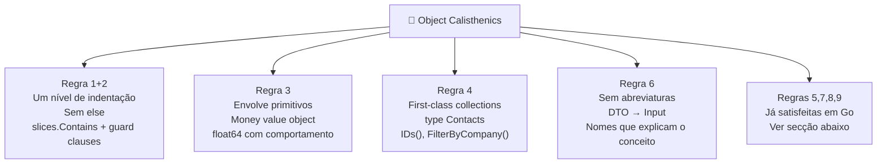

<!-- NAVIGATION BAR -->
<div align="center">

**[⬅️ M12 — SOLID](https://github.com/titi-byte-dev/gorm-crm/tree/branch-12-solid)** &nbsp;|&nbsp;
`branch-13-calisthenics` &nbsp;|&nbsp;
**[M14 — Testes Automatizados ➡️](https://github.com/titi-byte-dev/gorm-crm/tree/branch-14-tests)**

`█████████████░░░░░░░` Módulo **13 / 18** — Nível 🔵 Pleno

</div>

---

# 🤸 Módulo 13 — Object Calisthenics em Go

[](https://github.com/titi-byte-dev/gorm-crm/actions/workflows/ci.yml)
[](https://golang.org)
[](.)

> **O que foi construído:** As 9 regras de Object Calisthenics aplicadas ao GoRM — disciplina de código que força clareza mesmo quando não é obrigatório.

---

## 🎯 Objetivos de Aprendizagem

Ao terminar este módulo consegues:

- [ ] Identificar código com múltiplos níveis de indentação e aplanar
- [ ] Usar guard clauses em vez de else aninhado
- [ ] Criar value objects para primitivos com semântica de domínio
- [ ] Criar first-class collections com comportamento próprio
- [ ] Explicar porque `Input` é melhor que `DTO` como nome de tipo

---

## ⚡ Começa já

```bash
git checkout branch-13-calisthenics

# Os 4 commits — cada um é uma ou duas regras
git log --oneline branch-12-solid..branch-13-calisthenics

# Vê o Money value object
git show HEAD~2 -- pkg/valueobject/money.go

# Compara CanTransitionTo antes e depois
git diff branch-12-solid..branch-13-calisthenics -- internal/lead/model.go
```

---

## 🗺️ As 9 Regras no GoRM



---

## 🔍 Regra 1 — Um Nível de Indentação

> [!IMPORTANT]
> "Cada nível de indentação é uma decisão que o leitor tem de rastrear."

```go
// ❌ Antes — for + if = 2 níveis
func (s Status) CanTransitionTo(next Status) bool {
    transitions := map[Status][]Status{ ... }
    for _, allowed := range transitions[s] {  // nível 1
        if allowed == next {                   // nível 2
            return true
        }
    }
    return false
}

// ✅ Depois — um nível, intenção directa
func (s Status) CanTransitionTo(next Status) bool {
    transitions := map[Status][]Status{ ... }
    return slices.Contains(transitions[s], next)
}
```

---

## 🔍 Regra 2 — Sem Else

> [!NOTE]
> "Else esconde o caminho feliz. Guard clauses tornam-no óbvio."

```go
// ❌ Antes — else implícito via variável mutável
evtType := events.DealLost
if newStage == StageWon {
    evtType = events.DealWon
}
// leitor tem de rastrear o valor de evtType

// ✅ Depois — extracção para função nomeada
if newStage.IsClosed() {
    s.bus.Publish(events.Event{Type: closedEventType(newStage), ...})
}

func closedEventType(stage Stage) events.EventType {
    if stage == StageWon { return events.DealWon }
    return events.DealLost
}
```

---

## 🔍 Regra 3 — Envolve Primitivos

> [!TIP]
> "Um float64 não sabe se é negativo. Money sabe."

```go
// ❌ Antes — primitivo nu
type Lead struct { Value float64 }
lead.Value = -500.0  // compila. Negócio inválido silencioso.

// ✅ Depois — value object com invariantes
type Lead struct { Value valueobject.Money }

value, err := valueobject.ParseMoney(dto.Value)  // valida na fronteira
lead.Value.IsZero()                               // comportamento próprio
lead.Value.String()                               // "500.00"
lead.Value.GreaterThan(other)                     // semântica clara
```

<details>
<summary>GORM e JSON funcionam sem configuração adicional</summary>

```go
// type Money float64 — tipo base compatível com GORM e encoding/json
// GORM armazena como NUMERIC/FLOAT na base de dados
// JSON serializa como número: {"value": 500.00}

// A conversão explícita fica isolada no repositório:
func recordToLead(r leadRecord) *Lead {
    return &Lead{Value: valueobject.Money(r.Value)}  // float64 → Money
}
func leadToRecord(l *Lead) leadRecord {
    return leadRecord{Value: l.Value.Float64()}       // Money → float64
}
```

</details>

---

## 🔍 Regra 4 — First-Class Collections

> [!IMPORTANT]
> "Se tens uma colecção, cria uma struct só para ela."

```go
// ❌ Antes — slice exposto, lógica de iteração no caller
contacts, _, _ := svc.List(ownerID, filters)
var ids []uuid.UUID
for _, c := range contacts { ids = append(ids, c.ID) }

// ✅ Depois — colecção com comportamento de domínio
type Contacts []*Contact
func (cs Contacts) IDs() []uuid.UUID      { ... }
func (cs Contacts) FilterByCompany(s string) Contacts { ... }
func (cs Contacts) HasEmail(email string) bool { ... }

// Uso:
contacts, _, _ := svc.List(ownerID, filters)
ids := contacts.IDs()
acme := contacts.FilterByCompany("ACME")
```

---

## 🔍 Regra 6 — Sem Abreviaturas

> [!NOTE]
> "Se precisas de abreviar, o conceito é pouco claro."

```go
// ❌ Antes — DTO: jargão de camadas
type CreateContactDTO struct { ... }
// "DTO" = Data Transfer Object — o leitor precisa de saber o acrónimo

// ✅ Depois — Input: o que o tipo é
type CreateContactInput struct { ... }
// Descreve exactamente o que é: a entrada para esta operação
```

**Regra 6 em Go — o que não mudar:**
| Nome | Decisão | Porquê |
|------|---------|--------|
| `err` | Manter | Convenção universal Go |
| `c *fiber.Ctx` | Manter | Convenção do framework |
| `id` | Manter | Contexto torna o nome óbvio |
| `DTO` → `Input` | Mudar | Acrónimo sem contexto implícito |
| `svc` → `service` | Caso a caso | Em struct fields, mais claro |

---

## 🔍 Regras já satisfeitas em Go

| Regra | Estado | Porquê |
|-------|--------|--------|
| Regra 5: One dot per line | N/A em Go | Go não encoraja method chaining |
| Regra 7: Entidades pequenas | ✅ | Convenção Go: ficheiros < 200 linhas |
| Regra 8: Máx. 2 variáveis de instância | Adaptada | Em Go, agrupa com embedding |
| Regra 9: Sem getters/setters | ✅ | Go usa acesso directo a campos |

---

## 🎯 Desafio

Ver [CHALLENGE.md](CHALLENGE.md)

- **Nível 1** — Cria `type Leads []*Lead` com `FilterByStatus()` e `TotalValue() Money`
- **Nível 2** — Cria `pkg/valueobject/email.go` com `Email` type e `ParseEmail()`
- **Nível 3** — Aplica Regra 1 a qualquer método com 2+ níveis que encontres

---

## ✅ Checklist antes de avançar

- [ ] Consegues identificar onde `slices.Contains` substitui `for + if`?
- [ ] Sabes quando criar um value object vs usar o primitivo directamente?
- [ ] Entendes porque `Contacts` tem mais valor que `[]*Contact`?
- [ ] Sabes qual a diferença entre uma abreviatura e uma convenção Go?

---

<!-- NAVIGATION BAR BOTTOM -->
<div align="center">

**[⬅️ M12 — SOLID](https://github.com/titi-byte-dev/gorm-crm/tree/branch-12-solid)** &nbsp;|&nbsp;
`13 / 18` &nbsp;|&nbsp;
**[M14 — Testes Automatizados ➡️](https://github.com/titi-byte-dev/gorm-crm/tree/branch-14-tests)**

</div>
