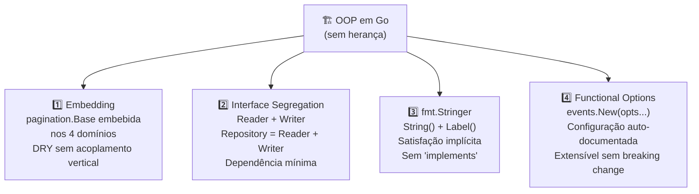

<!-- NAVIGATION BAR -->
<div align="center">

**[⬅️ M10 — Clean Code](https://github.com/titi-byte-dev/gorm-crm/tree/branch-10-clean-code)** &nbsp;|&nbsp;
`branch-11-oop` &nbsp;|&nbsp;
**[M12 — SOLID ➡️](https://github.com/titi-byte-dev/gorm-crm/tree/branch-12-solid)**

`███████████░░░░░░░░░` Módulo **11 / 18** — Nível 🔵 Pleno

</div>

---

# 🏗️ Módulo 11 — OOP Avançado em Go

[](https://github.com/titi-byte-dev/gorm-crm/actions/workflows/ci.yml)
[](https://golang.org)
[](.)

> **O que foi construído:** Go não tem herança. Este módulo mostra os 4 mecanismos que Go usa em vez disso — e porque cada um é mais seguro do que a herança clássica.

---

## 🎯 Objetivos de Aprendizagem

Ao terminar este módulo consegues:

- [ ] Usar embedding para composição sem herança
- [ ] Segregar interfaces em Reader + Writer (ISP)
- [ ] Implementar `fmt.Stringer` implicitamente
- [ ] Aplicar o padrão Functional Options
- [ ] Explicar porque Go favorece composição sobre herança

---

## ⚡ Começa já

```bash
git checkout branch-11-oop

# Vê os 4 commits — cada um é um mecanismo OOP
git log --oneline branch-10-clean-code..branch-11-oop

# Compara a interface antes e depois da segregação
git diff branch-10-clean-code..branch-11-oop -- internal/contact/model.go

# Vê o Functional Options em acção
git diff branch-10-clean-code..branch-11-oop -- internal/shared/events/events.go
```

---

## 🗺️ Os 4 Mecanismos



---

## 🔍 Conceito 1 — Embedding vs Herança

> [!IMPORTANT]
> Go não tem `extends`. Tem embedding — que é diferente e mais seguro.

```go
// ❌ Herança clássica (Java) — acoplamento vertical
class ContactFilters extends BaseFilters {
    String search;
    // Problema: mudanças em BaseFilters afectam ContactFilters
    // O filho depende dos detalhes do pai
}

// ✅ Embedding (Go) — composição horizontal
type Filters struct {
    pagination.Base   // promoção de métodos: Offset(), Normalize()
    Search  string
    Company string
}
// filters.Offset() funciona — promovido de Base
// Mas Filters e Base são independentes: sem hierarquia
```

<details>
<summary>Ver como o compilador vê o embedding</summary>

```go
// O que escreves:
filters.Offset()

// O que o compilador expande para:
filters.Base.Offset()

// São equivalentes — o compilador faz a promoção automaticamente.
// Mas podes sempre ser explícito: filters.Base.Page = 2
```

</details>

---

## 🔍 Conceito 2 — Interface Segregation

> [!NOTE]
> O "I" do SOLID: nenhum cliente deve depender de métodos que não usa.

```go
// ✅ Interfaces segregadas — cada consumer recebe o mínimo
type Reader interface {
    FindByID(id uuid.UUID) (*Contact, error)
    FindAll(ownerID uuid.UUID, filters Filters) ([]*Contact, int64, error)
    FindByEmail(email string) (*Contact, error)
}

type Writer interface {
    Save(contact *Contact) (*Contact, error)
    Update(contact *Contact) (*Contact, error)
    Delete(id uuid.UUID) error
}

// Repository é a composição — o Service usa isto
type Repository interface {
    Reader
    Writer
}

// Um serviço de relatórios recebe apenas Reader — não consegue apagar dados
func NewReportService(repo contact.Reader) *ReportService { ... }
```

---

## 🔍 Conceito 3 — fmt.Stringer implícito

> [!TIP]
> Em Go, interfaces são satisfeitas implicitamente — sem `implements`.

```go
// Implementar fmt.Stringer: apenas um método String() string
func (s Status) String() string { return string(s) }
func (s Status) Label() string  { return labels[s] } // PT label para UI

// Resultado automático em todo o ecosistema Go:
s := lead.StatusNew
fmt.Println(s)              // "new"    ← usa String()
log.Info("status", "v", s) // v=new    ← usa String()
fmt.Sprintf("Status: %s", s) // "Status: new"
```

```go
// Verificação em compile-time que o tipo satisfaz a interface:
var _ fmt.Stringer = lead.StatusNew  // falha se String() não existir
```

---

## 🔍 Conceito 4 — Functional Options

> [!IMPORTANT]
> Parametros posicionais com tipos iguais são uma fonte clássica de bugs silenciosos.

```go
// ❌ Antes — ordem importa, fácil de trocar
events.New(500, log)
events.New(log, 500)  // compila! mas está errado — o compilador não detecta

// ✅ Depois — auto-documentado, ordem irrelevante
bus := events.New(
    events.WithBufferSize(500),
    events.WithLogger(log),
)

// Adicionar nova opção no futuro não quebra nenhum caller:
// events.WithMetrics(metricsClient)  ← zero breaking change
```

<details>
<summary>Ver a implementação interna do padrão</summary>

```go
type Option func(*busConfig)    // Option é uma função

func WithBufferSize(n int) Option {
    return func(c *busConfig) { c.bufferSize = n }  // closure captura n
}

func New(opts ...Option) *Bus {
    cfg := &busConfig{bufferSize: DefaultBufferSize, logger: slog.Default()}
    for _, opt := range opts {
        opt(cfg)    // aplica cada opção à config
    }
    return &Bus{ch: make(chan Event, cfg.bufferSize), ...}
}
```

</details>

---

## 🎯 Desafio

Ver [CHALLENGE.md](CHALLENGE.md)

- **Nível 1** — Adiciona `Label()` a `activitylog.EntityType` em português
- **Nível 2** — Cria uma interface `Labeler` e verifica que os 4 tipos a satisfazem
- **Nível 3** — Adiciona `WithTimeout(d time.Duration)` ao `events.Bus` usando Functional Options

---

## ✅ Checklist antes de avançar

- [ ] Consegues explicar a diferença entre embedding e herança?
- [ ] Sabes quando usar `Reader` em vez de `Repository` como parâmetro?
- [ ] Implementaste `String()` num tipo próprio e verificaste com `var _ fmt.Stringer`?
- [ ] Consegues adicionar uma nova `Option` ao Bus sem quebrar os callers?

---

<!-- NAVIGATION BAR BOTTOM -->
<div align="center">

**[⬅️ M10 — Clean Code](https://github.com/titi-byte-dev/gorm-crm/tree/branch-10-clean-code)** &nbsp;|&nbsp;
`11 / 18` &nbsp;|&nbsp;
**[M12 — SOLID ➡️](https://github.com/titi-byte-dev/gorm-crm/tree/branch-12-solid)**

</div>
