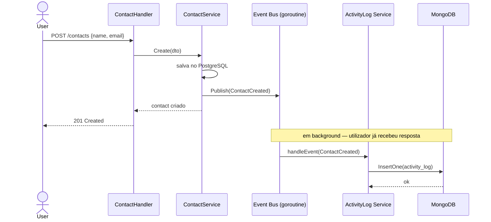

<!-- NAVIGATION BAR -->
<div align="center">

**[⬅️ M08 — Docker 🏆](https://github.com/titi-byte-dev/gorm-crm/tree/branch-08-docker)** &nbsp;|&nbsp;
`branch-09-nosql` &nbsp;|&nbsp;
**[M10 — Clean Code ➡️](https://github.com/titi-byte-dev/gorm-crm/tree/branch-10-clean-code)**

`█████████░░░░░░░░░░░` Módulo **09 / 18** — Nível 🔵 Pleno

</div>

---

# 🍃 Módulo 09 — NoSQL & MongoDB

[](https://github.com/titi-byte-dev/gorm-crm/actions/workflows/ci.yml)
[](.)
[](.)

> **O que foi construído:** Activity logs em MongoDB. Cada acção no CRM (criar contacto, ganhar deal, etc.) gera automaticamente um log persistido no MongoDB via Event Bus — sem alterar uma linha dos serviços existentes.

---

## 🎯 Objetivos de Aprendizagem

Ao terminar este módulo consegues:

- [ ] Explicar quando usar NoSQL vs SQL e porquê
- [ ] Ligar uma app Go ao MongoDB com o driver oficial
- [ ] Criar índices MongoDB incluindo TTL (expiração automática)
- [ ] Implementar o padrão Observer com Event Bus e goroutines
- [ ] Aplicar graceful degradation — funcionalidade secundária que falha sem quebrar o sistema

---

## ⚡ Começa já

```bash
git checkout branch-09-nosql
make docker/up   # inicia postgres + mongodb

# Login e cria um contacto
TOKEN=$(curl -s -X POST http://localhost:8080/api/v1/auth/login \
  -H "Content-Type: application/json" \
  -d '{"email":"admin@crm.com","password":"segredo123"}' | jq -r .access_token)

curl -X POST http://localhost:8080/api/v1/contacts \
  -H "Authorization: Bearer $TOKEN" \
  -H "Content-Type: application/json" \
  -d '{"name":"João Silva","email":"joao@x.com"}'

# Ver os logs gerados automaticamente
curl -H "Authorization: Bearer $TOKEN" \
  http://localhost:8080/api/v1/activity/me
```

---

## 🗺️ Como os logs chegam ao MongoDB



---

## 🔍 Conceitos-Chave

### SQL vs NoSQL — quando usar cada um

<details>
<summary><strong>Ver: comparação com o caso real do GoRM</strong></summary>

```
PostgreSQL — dados relacionais do CRM:
  ✅ Relações entre entidades (contact → lead → deal)
  ✅ Transações ACID ("criar deal e actualizar lead atomicamente")
  ✅ Queries complexas com JOINs
  ✅ Integridade referencial (FK constraints)

MongoDB — activity logs:
  ✅ Schema flexível (cada evento tem payload diferente)
  ✅ Alta taxa de writes (um log por acção)
  ✅ Queries simples (find por user_id, find por entity_id)
  ✅ TTL automático (logs expiram após 90 dias)
  ❌ Sem JOINs — não serve para dados relacionais
```

</details>

---

### TTL Index — expiração automática

> [!TIP]
> O MongoDB pode apagar documentos automaticamente com um TTL Index — sem cron jobs, sem código de limpeza.

```go
// Criado uma vez no startup — apaga logs com mais de 90 dias
options.Index().SetExpireAfterSeconds(90 * 24 * 3600)
```

---

### Graceful Degradation

> [!NOTE]
> A app funciona sem MongoDB. Se o Mongo estiver em baixo, os logs são descartados silenciosamente — mas contactos, leads e deals continuam a funcionar.

```go
mongoDB, err = database.NewMongo(...)
if err != nil {
    log.Warn("mongodb unavailable — activity logging disabled")
    // NÃO faz os.Exit(1)  ← funcionalidade secundária não é crítica
}
```

---

## 📁 Ficheiros deste módulo

```
Criados:
├── pkg/database/mongodb.go
├── internal/activitylog/
│   ├── model.go           ← Log struct com bson tags + Repository interface
│   ├── repository_mongo.go← BSON, índices, TTL, sort por ObjectID
│   ├── service.go         ← Observer: RegisterHandlers no Event Bus
│   └── handler.go         ← GET /activity/me e /activity/:type/:id

Modificados:
├── docker-compose.yml     ← MongoDB descomentado
└── cmd/api/main.go        ← MongoDB opcional + wiring
```

---

## 🎯 Desafio

Ver [CHALLENGE.md](CHALLENGE.md)

- **Nível 1** — Cria um contacto e um deal, depois vê os logs em `/activity/me`
- **Nível 2** — Implementa `GET /activity/contact/:id` usando o endpoint de entidade
- **Nível 3** — Altera o TTL de 90 para 30 dias e verifica que o índice foi recriado

---

## ✅ Checklist antes de avançar

- [ ] `make docker/up` e a app mostra "mongodb connected" nos logs
- [ ] Criaste um contacto e viste o log em `/activity/me`
- [ ] Consegues explicar porquê MongoDB para logs e não PostgreSQL
- [ ] Entendes graceful degradation — funcionalidade secundária que falha sem quebrar o sistema

---

<!-- NAVIGATION BAR BOTTOM -->
<div align="center">

**[⬅️ M08 — Docker 🏆](https://github.com/titi-byte-dev/gorm-crm/tree/branch-08-docker)** &nbsp;|&nbsp;
`09 / 18` &nbsp;|&nbsp;
**[M10 — Clean Code ➡️](https://github.com/titi-byte-dev/gorm-crm/tree/branch-10-clean-code)**

</div>
