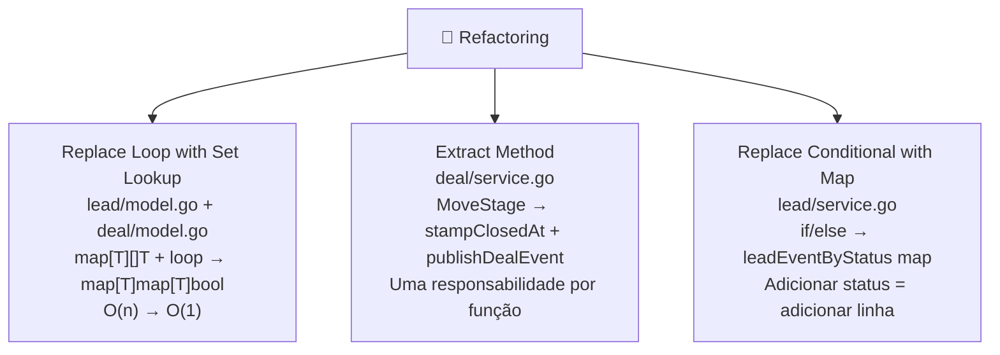

<!-- NAVIGATION BAR -->
<div align="center">

**[⬅️ M15 — Design Patterns](https://github.com/titi-byte-dev/gorm-crm/tree/branch-15-patterns)** &nbsp;|&nbsp;
`branch-16-refactoring` &nbsp;|&nbsp;
**[M17 — Performance & Cache ➡️](https://github.com/titi-byte-dev/gorm-crm/tree/branch-17-performance)**

`████████████████░░░░` Módulo **16 / 18** — Nível 🔵 Pleno

</div>

---

# 🔧 Módulo 16 — Refactoring em Go

[](https://github.com/titi-byte-dev/gorm-crm/actions/workflows/ci.yml)
[](https://golang.org)
[](.)

> **O que foi construído:** Três refactorizações identificadas por code smell — loop linear substituído por set lookup, método longo decomposto com Extract Method, e if/else substituído por lookup table.

---

## 🎯 Objetivos de Aprendizagem

Ao terminar este módulo consegues:

- [ ] Identificar code smells (Long Method, Duplicated Algorithm, Switch Statements)
- [ ] Aplicar Extract Method para decompor métodos com responsabilidades misturadas
- [ ] Substituir if/else chains por lookup tables (Replace Conditional with Map)
- [ ] Explicar a diferença entre refactoring e reescrita

---

## ⚡ Começa já

```bash
git checkout branch-16-refactoring

# Os 3 commits de refactoring
git log --oneline branch-15-patterns..branch-16-refactoring

# Vê o set lookup
git show HEAD~2 -- internal/lead/model.go

# Vê o Extract Method
git show HEAD~1 -- internal/deal/service.go

# Vê a lookup table
git show HEAD -- internal/lead/service.go
```

---

## 🗺️ Os 3 Refactorings



---

## 🔍 Refactoring 1 — Replace Loop with Set Lookup

> [!IMPORTANT]
> "Code smell: Algoritmo duplicado em dois packages com a mesma estrutura map+loop."

```go
// ❌ Antes — aloca slice, itera, compara
func (s Status) CanTransitionTo(next Status) bool {
    transitions := map[Status][]Status{
        StatusNew: {StatusContacted, StatusLost},
        // ...
    }
    for _, allowed := range transitions[s] {  // loop desnecessário
        if allowed == next {
            return true
        }
    }
    return false
}

// ✅ Depois — set lookup direto, O(1)
var leadTransitions = map[Status]map[Status]bool{
    StatusNew: {StatusContacted: true, StatusLost: true},
    // ...
}

func (s Status) CanTransitionTo(next Status) bool {
    return leadTransitions[s][next]  // uma linha
}
```

**Por que package-level?** A tabela é imutável após init. Declarada uma vez, partilhada por todas as chamadas — sem alocação por chamada.

---

## 🔍 Refactoring 2 — Extract Method

> [!NOTE]
> "Code smell: Long Method — MoveStage fazia 4 coisas diferentes no mesmo corpo."

```go
// ❌ Antes — um método, 4 responsabilidades
func (s *Service) MoveStage(id uuid.UUID, newStage Stage) (*Deal, error) {
    // 1. buscar
    // 2. validar transição
    // 3. carimbar ClosedAt (lógica de negócio inline)
    if newStage.IsClosed() {
        now := time.Now()
        deal.ClosedAt = &now
    }
    // 4. selecionar e publicar evento (mais lógica inline)
    evtType := events.DealLost
    if newStage == StageWon { evtType = events.DealWon }
    if newStage.IsClosed() { s.bus.Publish(...) }
}

// ✅ Depois — cada função tem uma razão para mudar
func (s *Service) MoveStage(id uuid.UUID, newStage Stage) (*Deal, error) {
    deal, err := s.repo.FindByID(id)
    // ...validar...
    deal.Stage = newStage
    stampClosedAt(deal)          // Extract Method
    updated, err := s.repo.Update(deal)
    s.publishDealEvent(updated)  // Extract Method
    return updated, nil
}

func stampClosedAt(d *Deal) { /* ... */ }
func (s *Service) publishDealEvent(d *Deal) { /* ... */ }
```

---

## 🔍 Refactoring 3 — Replace Conditional with Map

> [!TIP]
> "Code smell: Switch/if-else que cresce com novos estados — Open/Closed violado."

```go
// ❌ Antes — novo status = novo ramo no if/else
if newStatus == StatusLost {
    s.bus.Publish(events.Event{Type: events.LeadLost, ...})
} else if newStatus == StatusQualified {
    s.bus.Publish(events.Event{Type: events.LeadConverted, ...})
}

// ✅ Depois — novo status = nova linha na tabela
var leadEventByStatus = map[Status]events.EventType{
    StatusLost:      events.LeadLost,
    StatusQualified: events.LeadConverted,
}

func (s *Service) publishStatusEvent(l *Lead, status Status) {
    evtType, ok := leadEventByStatus[status]
    if !ok { return }
    s.bus.Publish(events.Event{Type: evtType, Payload: l, UserID: l.OwnerID.String()})
}
```

---

## 📊 Code Smells → Técnicas

| Code Smell | Onde | Técnica Aplicada |
|------------|------|-----------------|
| Duplicated Algorithm | `lead/model.go`, `deal/model.go` | Replace Loop with Set |
| Long Method | `deal/service.go` — MoveStage | Extract Method |
| Switch Statements | `lead/service.go` — UpdateStatus | Replace Conditional with Map |

---

## 🎯 Desafio

Ver [CHALLENGE.md](CHALLENGE.md)

- **Nível 1** — Aplica Replace Conditional with Map no `deal/service.go` para o evento de MoveStage
- **Nível 2** — `activitylog/service.go` tem `entityTypeFromEventType` com um switch longo — extrai para lookup table
- **Nível 3** — `Filters.SetDefaults()` está duplicado em `lead` e `deal` — o que fariais?

---

## ✅ Checklist antes de avançar

- [ ] Consegues nomear os 3 code smells que foram resolvidos?
- [ ] Sabes a diferença entre Extract Method e Extract Class?
- [ ] Entendes por que a tabela de transições é package-level e não criada por chamada?
- [ ] Consegues identificar o próximo code smell no codebase?

---

<!-- NAVIGATION BAR BOTTOM -->
<div align="center">

**[⬅️ M15 — Design Patterns](https://github.com/titi-byte-dev/gorm-crm/tree/branch-15-patterns)** &nbsp;|&nbsp;
`16 / 18` &nbsp;|&nbsp;
**[M17 — Performance & Cache ➡️](https://github.com/titi-byte-dev/gorm-crm/tree/branch-17-performance)**

</div>
