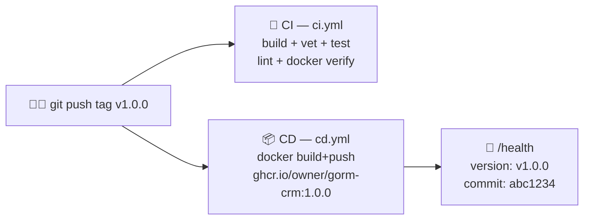

<!-- NAVIGATION BAR -->
<div align="center">

**[⬅️ M17 — Performance & Cache](https://github.com/titi-byte-dev/gorm-crm/tree/branch-17-performance)** &nbsp;|&nbsp;
`branch-18-cicd` &nbsp;|&nbsp;
🏁 **Módulo Final**

`████████████████████` Módulo **18 / 18** — Nível 🔴 Sénior

</div>

---

# 🚀 Módulo 18 — Cloud & CI/CD

[](https://github.com/titi-byte-dev/gorm-crm/actions/workflows/ci.yml)
[](https://github.com/titi-byte-dev/gorm-crm/actions/workflows/cd.yml)
[](https://golang.org)
[](.)

> **O que foi construído:** Pipeline CI/CD completo — build-time version injection via `-ldflags`, CD workflow que publica imagem Docker no ghcr.io em cada tag semver, e docker-compose override para desenvolvimento local com Redis.

---

## 🎯 Objetivos de Aprendizagem

Ao terminar este módulo consegues:

- [ ] Injetar version/commit/buildtime no binário Go via `-ldflags`
- [ ] Criar um CD workflow que publica imagem Docker ao criar tag `v*`
- [ ] Separar docker-compose base (produção) de override (desenvolvimento)
- [ ] Fazer deploy de uma nova versão com `make release TAG=v1.0.0`

---

## ⚡ Começa já

```bash
git checkout branch-18-cicd

git log --oneline branch-17-performance..branch-18-cicd

# Version injection
make build && ./bin/gorm-crm --version 2>/dev/null || curl localhost:8080/health

# Ver o CD workflow
cat .github/workflows/cd.yml

# Dev com hot-reload
docker-compose up -d       # usa override.yml automaticamente
```

---

## 🗺️ Os 3 Componentes



---

## 🔍 Version Injection — `-ldflags`

> [!IMPORTANT]
> "Sem version injection, `/health` devolve `'0.9.0'` hardcoded. Com ela, cada binário sabe quem é."

```go
// pkg/version/version.go — default em desenvolvimento
var (
    Version   = "dev"
    Commit    = "unknown"
    BuildTime = "unknown"
)

// Em runtime — valores reais injectados pelo compilador
// $ curl localhost:8080/health
// { "version": "v1.2.0", "commit": "a3f9b12" }
```

```makefile
# Makefile — make build injeta automaticamente
LDFLAGS = -s -w \
  -X .../pkg/version.Version=$(VERSION) \
  -X .../pkg/version.Commit=$(COMMIT) \
  -X .../pkg/version.BuildTime=$(BUILDTIME)
```

```dockerfile
# Dockerfile — ARGs passados pelo CI
ARG VERSION=dev
RUN go build -ldflags="-s -w -X .../version.Version=${VERSION} ..."
```

---

## 🔍 CI/CD — Dois Workflows, Duas Responsabilidades

> [!NOTE]
> "CI verifica cada push. CD só corre quando decides fazer release."

```yaml
# ci.yml — 3 jobs paralelos em cada push
jobs:
  build-and-test:  # go build + go test -race + coverage artifact
  lint:            # golangci-lint — estilo, bugs estáticos, segurança
  docker:          # docker build --target runtime — verifica que a imagem compila

# cd.yml — triggered só em push de tag v*
on:
  push:
    tags: ["v*"]

# Resultado: ghcr.io/owner/gorm-crm:1.2.0
#                                   :1.2
#                                   :sha-a3f9b12
```

---

## 🔍 docker-compose Override — Dev vs Produção

> [!TIP]
> "O ficheiro override é aplicado automaticamente. Em CI ele não existe — comportamento diferente sem flags."

```yaml
# docker-compose.yml — base (produção/CI)
services:
  api:
    build:
      target: runtime    # imagem mínima ~15MB

# docker-compose.override.yml — dev (aplicado automaticamente)
services:
  api:
    build:
      target: builder    # tem Go toolchain
    volumes:
      - .:/app           # hot-reload: go run relê ficheiros alterados
  redis:                 # cache activa em dev
    image: redis:7-alpine
```

**Ciclo de release:**

```bash
# 1. Código pronto, testes a passar
make test

# 2. Criar e publicar tag — CD dispara automaticamente
make release TAG=v1.2.0

# 3. Verificar no GitHub Actions
# 4. Imagem disponível em ghcr.io
docker pull ghcr.io/titi-byte-dev/gorm-crm:1.2.0
```

---

## 📊 Pipeline Completo

| Evento | Workflow | Resultado |
|--------|----------|-----------|
| `git push branch-*` | CI | build + test + lint + docker verify |
| `git push main` | CI | idem |
| `git push tag v1.0.0` | CI + CD | CI passa → CD publica imagem |
| `docker-compose up` (dev) | — | override ativo, Redis, hot-reload |
| `docker-compose up` (CI) | — | sem override, imagem runtime |

---

## 🎯 Desafio

Ver [CHALLENGE.md](CHALLENGE.md)

- **Nível 1** — Adiciona `make version` e verifica que os valores são injectados no binário
- **Nível 2** — Adiciona um job `security` ao CI com `govulncheck ./...`
- **Nível 3** — Estende o CD para deploy automático num servidor remoto via SSH após push da imagem

---

## ✅ Checklist — Curso Completo

- [ ] M01–M06: Fundamentos Go, GORM, REST, Auth, Migrations, NoSQL
- [ ] M07–M10: Events, Middlewares, Clean Architecture, Clean Code
- [ ] M11–M13: OOP, Object Calisthenics, DDD
- [ ] M14–M15: Testes Automatizados, Design Patterns
- [ ] M16–M17: Refactoring, Performance & Cache
- [ ] M18: Cloud & CI/CD ← estás aqui

**Conseguiste construir um CRM production-ready do zero. Cada módulo adicionou uma camada — de CRUD simples a pipeline CI/CD completo.**

---

<!-- NAVIGATION BAR BOTTOM -->
<div align="center">

**[⬅️ M17 — Performance & Cache](https://github.com/titi-byte-dev/gorm-crm/tree/branch-17-performance)** &nbsp;|&nbsp;
`18 / 18` &nbsp;|&nbsp;
🏁 **Fim do Curso**

</div>
