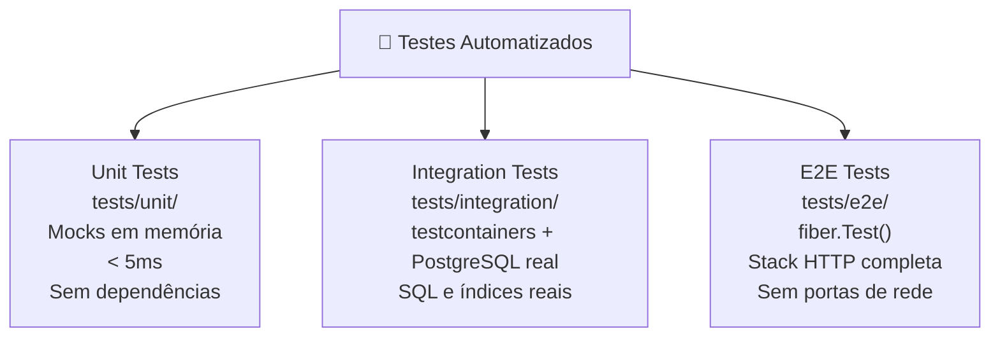

<!-- NAVIGATION BAR -->
<div align="center">

**[⬅️ M13 — Object Calisthenics](https://github.com/titi-byte-dev/gorm-crm/tree/branch-13-calisthenics)** &nbsp;|&nbsp;
`branch-14-tests` &nbsp;|&nbsp;
**[M15 — Design Patterns ➡️](https://github.com/titi-byte-dev/gorm-crm/tree/branch-15-patterns)**

`██████████████░░░░░░` Módulo **14 / 18** — Nível 🔵 Pleno

</div>

---

# 🧪 Módulo 14 — Testes Automatizados em Go

[](https://github.com/titi-byte-dev/gorm-crm/actions/workflows/ci.yml)
[](https://golang.org)
[](.)

> **O que foi construído:** Três camadas de testes — unit, integration com testcontainers, e2e com fiber.Test() — cobrindo os domínios contact, lead e deal.

---

## 🎯 Objetivos de Aprendizagem

Ao terminar este módulo consegues:

- [ ] Escrever table-driven tests para múltiplos cenários sem repetição
- [ ] Implementar mocks em memória que o compilador valida com `var _ Interface = (*Type)(nil)`
- [ ] Usar testcontainers para testar repositórios contra PostgreSQL real
- [ ] Testar handlers HTTP com `fiber.Test()` sem abrir portas de rede
- [ ] Distinguir o que pertence a cada camada de teste

---

## ⚡ Começa já

```bash
git checkout branch-14-tests

# Unit tests — sem dependências externas, < 5ms
go test ./tests/unit/... -v

# Integration tests — requer Docker
go test ./tests/integration/... -v

# E2E tests — sem Docker, sem portas
go test ./tests/e2e/... -v

# Tudo junto com coverage
go test ./tests/... -cover
```

---

## 🗺️ As Três Camadas



---

## 🔍 Unit Tests — Table-Driven

> [!IMPORTANT]
> "Table-driven tests são o idioma Go para cobrir N cenários com um loop."

```go
// ❌ Antes — um test por cenário, repetição de setup
func TestLeadStatus_NewToContacted(t *testing.T) {
    if !lead.StatusNew.CanTransitionTo(lead.StatusContacted) {
        t.Error("should be valid")
    }
}
func TestLeadStatus_NewToQualified(t *testing.T) { ... } // mais 7 funções

// ✅ Depois — uma tabela, um loop
tests := []struct {
    name     string
    from, to lead.Status
    expected bool
}{
    {"new → contacted", StatusNew, StatusContacted, true},
    {"new → qualified: inválido", StatusNew, StatusQualified, false},
    // ... mais casos numa linha cada
}
for _, tt := range tests {
    t.Run(tt.name, func(t *testing.T) {
        t.Parallel()
        if got := tt.from.CanTransitionTo(tt.to); got != tt.expected { ... }
    })
}
```

**O que está coberto:**

| Domínio | Testes | Foco |
|---------|--------|------|
| `contact` | Create, GetByID, Update, Delete | Regras de negócio e erros |
| `lead` | Create, UpdateStatus (5 casos) | Máquina de estados |
| `deal` | Create, MoveStage (5 casos), ClosedAt | Efeitos colaterais |

---

## 🔍 Mocks em Memória

> [!NOTE]
> "O mock está errado se o compilador não o diz — `var _` garante isso."

```go
// Compile-time assertion — falha no build, não em runtime
var _ contact.Repository = (*contactRepoMem)(nil)

type contactRepoMem struct {
    data    map[uuid.UUID]*contact.Contact
    byEmail map[string]*contact.Contact
}

// Se contact.Repository ganhar um novo método → erro de build imediato
```

**Por que mocks em vez de testify/mock?**

Go tem o `testing` package na stdlib. Para interfaces simples, uma struct com um map é suficiente e não adiciona dependências.

---

## 🔍 Integration Tests — testcontainers

> [!TIP]
> "Se o repositório usa SQL, o teste tem de usar SQL."

```go
func newTestDB(t *testing.T) *gorm.DB {
    ctr, _ := tcpostgres.Run(ctx,
        "postgres:16-alpine",
        tcpostgres.WithDatabase("testdb"),
        tcpostgres.BasicWaitStrategies(),
    )
    t.Cleanup(func() { ctr.Terminate(ctx) })

    dsn, _ := ctr.ConnectionString(ctx, "sslmode=disable")
    db, _ := gorm.Open(postgres.Open(dsn), ...)
    db.AutoMigrate(&contactRecord{})
    return db
}
```

**O que os testes de integração apanham que os mocks não apanham:**

```
✅ Índice único em email — constraint a nível de DB
✅ Ordenação SQL — ORDER BY funciona como esperado
✅ Paginação — LIMIT + OFFSET correcto
✅ Conversões de tipo — uuid ↔ VARCHAR
```

---

## 🔍 E2E Tests — fiber.Test()

> [!IMPORTANT]
> "Testar o handler é testar o contrato HTTP — status codes, parsing, routing."

```go
func newTestApp(t *testing.T) (*fiber.App, uuid.UUID) {
    ownerID := uuid.New()
    svc := contact.NewService(newContactRepoForE2E(), events.New(10, log))

    app := fiber.New(fiber.Config{ErrorHandler: sharederrors.Handler})

    // Substitui JWT por middleware de teste — sem tokens, sem chaves
    app.Use(func(c *fiber.Ctx) error {
        c.Locals("userID", ownerID)
        return c.Next()
    })

    contact.RegisterRoutes(app, svc)
    return app, ownerID
}
```

**Cenários cobertos:**

| Endpoint | Status | O que valida |
|----------|--------|--------------|
| `POST /contacts` | 201 | Criação + body de resposta |
| `POST /contacts` | 422 | Validação de campos obrigatórios |
| `POST /contacts` | 409 | Email duplicado → ErrConflict |
| `GET /contacts/:id` | 200 | Leitura por ID |
| `GET /contacts/:id` | 404 | ID inexistente → ErrNotFound |
| `DELETE /contacts/:id` | 204 | Remoção + verificação de ausência |

---

## 📊 Cobertura por Camada

| Camada | O que testa | Velocidade | Requer Docker |
|--------|-------------|-----------|---------------|
| Unit | Lógica de domínio, regras de negócio | < 5ms | ❌ |
| Integration | SQL, índices, paginação, tipos | ~3-5s | ✅ |
| E2E | Status HTTP, parsing, routing, erros | < 200ms | ❌ |

---

## 🎯 Desafio

Ver [CHALLENGE.md](CHALLENGE.md)

- **Nível 1** — Adiciona testes unitários para `task.Service` usando `SpyPublisher`
- **Nível 2** — Adiciona integration tests para `lead.Repository`
- **Nível 3** — Adiciona E2E tests para o lead pipeline (POST + PATCH status)

---

## ✅ Checklist antes de avançar

- [ ] Consegues explicar a diferença entre os três tipos de teste neste módulo?
- [ ] Sabes quando usar um mock em memória vs testcontainers?
- [ ] Entendes por que `fiber.Test()` não precisa de portas de rede?
- [ ] Consegues adicionar um novo caso a uma table-driven test sem copiar código?

---

<!-- NAVIGATION BAR BOTTOM -->
<div align="center">

**[⬅️ M13 — Object Calisthenics](https://github.com/titi-byte-dev/gorm-crm/tree/branch-13-calisthenics)** &nbsp;|&nbsp;
`14 / 18` &nbsp;|&nbsp;
**[M15 — Design Patterns ➡️](https://github.com/titi-byte-dev/gorm-crm/tree/branch-15-patterns)**

</div>
