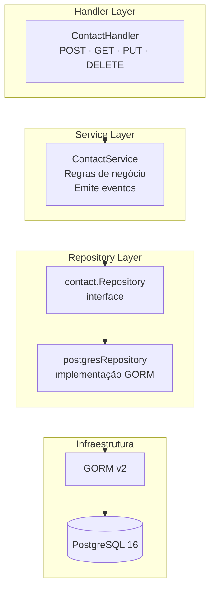
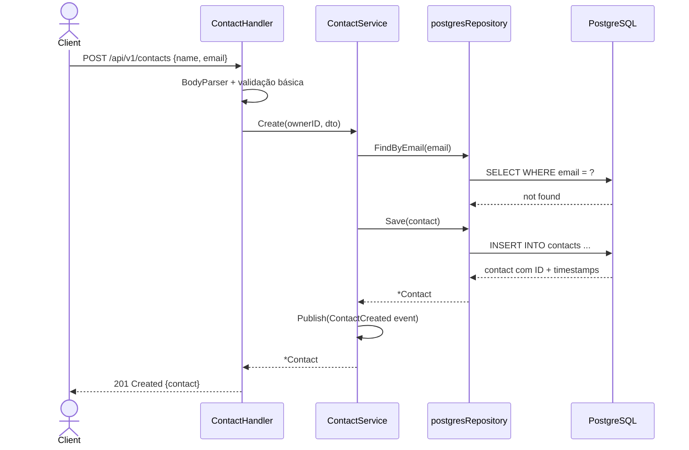

<!-- NAVIGATION BAR -->
<div align="center">

**[⬅️ M02 — Fundamentos Go](https://github.com/titi-byte-dev/gorm-crm/tree/branch-02-go-fundamentos)** &nbsp;|&nbsp;
`branch-03-sql` &nbsp;|&nbsp;
**[M04 — Git Workflow ➡️](https://github.com/titi-byte-dev/gorm-crm/tree/branch-04-git-workflow)**

`███░░░░░░░░░░░░░░░░░` Módulo **03 / 18** — Nível 🟢 Júnior

</div>

---

# 🗄️ Módulo 03 — SQL & PostgreSQL

[](https://github.com/titi-byte-dev/gorm-crm/actions/workflows/ci.yml)
[](https://golang.org)
[](https://postgresql.org)
[](.)

> **O que foi construído:** As `Repository interfaces` do M02 ganham implementação real em PostgreSQL. CRUD completo de Contactos com GORM, migrations versionadas e paginação com filtros.

---

## 🎯 Objetivos de Aprendizagem

Ao terminar este módulo consegues:

- [ ] Ligar uma app Go ao PostgreSQL com GORM
- [ ] Criar e correr migrations SQL versionadas
- [ ] Implementar CRUD completo com Repository Pattern
- [ ] Fazer queries com filtros, ordenação e paginação
- [ ] Separar o modelo GORM do domain model
- [ ] Usar transações ACID quando necessário

---

## ⚡ Começa já

```bash
git checkout branch-03-sql

# Inicia o PostgreSQL
docker-compose up -d postgres

# Copia e configura as variáveis de ambiente
cp .env.example .env

# Corre a app
make run

# Testa o CRUD
curl -X POST http://localhost:8080/api/v1/contacts \
  -H "Content-Type: application/json" \
  -d '{"name":"João Silva","email":"joao@example.com","company":"Acme"}'
```

> [!NOTE]
> Precisas de ter Docker instalado para correr o PostgreSQL. Alternativa: instala PostgreSQL localmente e ajusta o `.env`.

---

## 🗺️ O que foi construído



---

## 🔍 Conceitos-Chave

### Separação: Domain Model vs GORM Record

> [!IMPORTANT]
> O domain model (`Contact` em `model.go`) não conhece GORM. O `contactRecord` é um detalhe de implementação do repositório — se um dia mudarmos de PostgreSQL para outro DB, o domain model não muda.

```go
// Domain model — puro Go, sem dependências externas
type Contact struct {
    ID      uuid.UUID
    Name    string
    Email   string
    OwnerID uuid.UUID
}

// GORM record — só existe dentro do repositório
type contactRecord struct {
    ID      uuid.UUID `gorm:"type:uuid;primaryKey"`
    Name    string    `gorm:"not null"`
    Email   string    `gorm:"uniqueIndex;not null"`
    OwnerID uuid.UUID `gorm:"type:uuid;not null;index"`
}
```

---

### Interface Satisfaction em Compile-Time

```go
// Esta linha faz o compilador verificar que postgresRepository
// implementa contact.Repository — erro imediato se falhar
var _ Repository = (*postgresRepository)(nil)
```

> [!TIP]
> É um padrão Go idiomático. Sem isto, só descobres que a interface não está implementada quando tentas usar o tipo — potencialmente em runtime.

---

### Paginação com Filters

<details>
<summary><strong>Ver: QueryString → Filters → SQL</strong></summary>

```
GET /api/v1/contacts?search=João&company=Acme&page=2&limit=10&sort_by=name&sort_dir=asc
```

```go
// Handler lê os query params
filters := Filters{
    Search:  c.Query("search"),   // "João"
    Company: c.Query("company"),  // "Acme"
    Page:    c.QueryInt("page", 1),
    Limit:   c.QueryInt("limit", 20),
}

// Repository gera a query
query.Where("name ILIKE ? OR email ILIKE ?", "%João%", "%João%").
      Where("company ILIKE ?", "%Acme%").
      Order("name asc").
      Limit(10).
      Offset(10) // (page-1) * limit
```

**Response envelope:**
```json
{
  "data":  [...],
  "total": 47,
  "page":  2,
  "limit": 10
}
```

</details>

---

### Migrations Versionadas

<details>
<summary><strong>Ver: estrutura de migrations</strong></summary>

```
migrations/
├── 001_create_users.up.sql      ← aplica
├── 001_create_users.down.sql    ← reverte
├── 002_create_contacts.up.sql
└── 002_create_contacts.down.sql
```

```sql
-- 002_create_contacts.up.sql
CREATE TABLE contacts (
    id         UUID PRIMARY KEY DEFAULT uuid_generate_v4(),
    name       VARCHAR(100) NOT NULL,
    email      VARCHAR(255) NOT NULL,
    owner_id   UUID NOT NULL REFERENCES users(id) ON DELETE CASCADE,
    created_at TIMESTAMPTZ NOT NULL DEFAULT NOW()
);

-- Índices para pesquisa ILIKE eficiente
CREATE INDEX idx_contacts_name_search ON contacts USING gin(name gin_trgm_ops);
```

> [!NOTE]
> O índice `gin_trgm_ops` usa trigrams para tornar o `ILIKE '%texto%'` eficiente. Sem ele, o PostgreSQL faz full table scan — lento em tabelas grandes.

</details>

---

## 📁 Ficheiros deste módulo

<details>
<summary><strong>Ver ficheiros criados/modificados</strong></summary>

```
Criados:
├── internal/contact/
│   ├── repository_pg.go   ← implementação PostgreSQL da contact.Repository
│   ├── service.go         ← CreateContactDTO, lógica de negócio, eventos
│   └── handler.go         ← HTTP handlers + RegisterRoutes
├── pkg/database/
│   └── postgres.go        ← conexão GORM + connection pool
├── migrations/
│   ├── 001_create_users.up.sql / .down.sql
│   └── 002_create_contacts.up.sql / .down.sql
└── docker-compose.yml     ← PostgreSQL local (MongoDB e Redis comentados)

Modificados:
└── cmd/api/main.go        ← liga DB + regista rotas de contactos
```

</details>

---

## 🔄 Fluxo de um Request



---

## 🎯 Desafio

Ver [CHALLENGE.md](CHALLENGE.md)

- **Nível 1** — Adiciona endpoint `GET /api/v1/contacts/:id/tasks` que devolve as tasks de um contacto
- **Nível 2** — Implementa soft delete (campo `deleted_at`) em vez de DELETE real
- **Nível 3** — Adiciona uma transação: criar um Lead automaticamente quando um Contacto é criado

---

## ✅ Checklist antes de avançar

- [ ] `docker-compose up -d postgres` e `make run` funcionam
- [ ] CRUD de contactos testado com `curl` ou Postman
- [ ] Entendes a diferença entre domain model e GORM record
- [ ] Sabes o que é `var _ Repository = (*postgresRepository)(nil)` e porquê

---

<!-- NAVIGATION BAR BOTTOM -->
<div align="center">

**[⬅️ M02 — Fundamentos Go](https://github.com/titi-byte-dev/gorm-crm/tree/branch-02-go-fundamentos)** &nbsp;|&nbsp;
`03 / 18` &nbsp;|&nbsp;
**[M04 — Git Workflow ➡️](https://github.com/titi-byte-dev/gorm-crm/tree/branch-04-git-workflow)**

</div>
