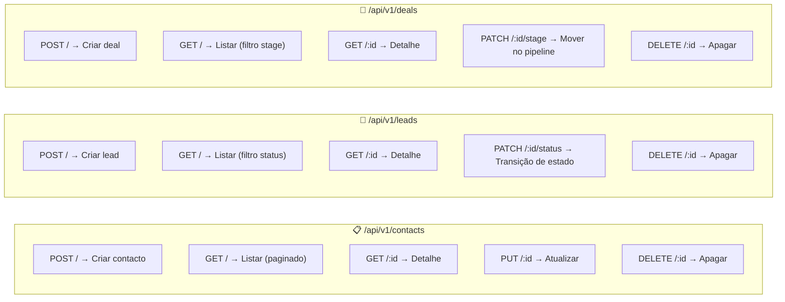
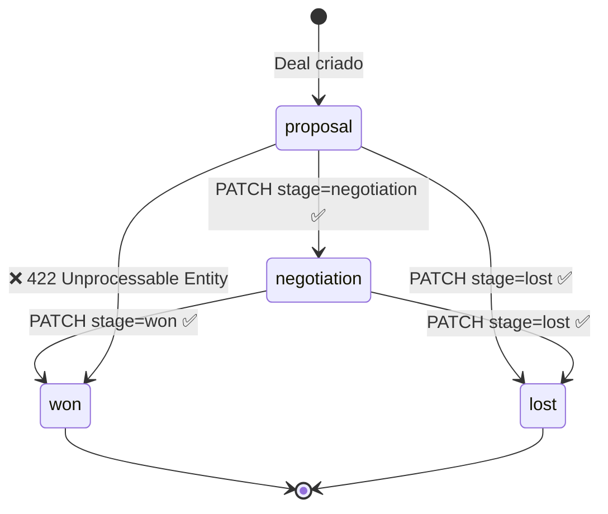

<!-- NAVIGATION BAR -->
<div align="center">

**[⬅️ M04 — Git Workflow](https://github.com/titi-byte-dev/gorm-crm/tree/branch-04-git-workflow)** &nbsp;|&nbsp;
`branch-05-rest-api` &nbsp;|&nbsp;
**[M06 — Autenticação ➡️](https://github.com/titi-byte-dev/gorm-crm/tree/branch-06-auth)**

`█████░░░░░░░░░░░░░░░` Módulo **05 / 18** — Nível 🟢 Júnior

</div>

---

# 🌐 Módulo 05 — REST API Completa

[](https://github.com/titi-byte-dev/gorm-crm/actions/workflows/ci.yml)
[](https://golang.org)
[](.)
[](.)

> **O que foi construído:** API REST completa para Contacts, Leads e Deals. Validação com `go-playground/validator`, resposta paginada padronizada, CORS e o pipeline de vendas com transições de estado controladas.

---

## 🎯 Objetivos de Aprendizagem

Ao terminar este módulo consegues:

- [ ] Estruturar uma REST API com múltiplos domínios
- [ ] Validar input com `go-playground/validator` e devolver erros descritivos
- [ ] Usar generics Go para um envelope de paginação reutilizável
- [ ] Controlar transições de estado numa API (pipeline de vendas)
- [ ] Configurar CORS para permitir consumo da API por frontends

---

## ⚡ Começa já

```bash
git checkout branch-05-rest-api
docker-compose up -d postgres
make run
```

```bash
# Criar um contacto
curl -X POST http://localhost:8080/api/v1/contacts \
  -H "Content-Type: application/json" \
  -d '{"name":"Ana Silva","email":"ana@empresa.com","company":"TechCorp"}'

# Criar um lead para o contacto
curl -X POST http://localhost:8080/api/v1/leads \
  -H "Content-Type: application/json" \
  -d '{"title":"Proposta SaaS","value":5000,"contact_id":"<id do contacto acima>"}'

# Mover o lead para qualified
curl -X PATCH http://localhost:8080/api/v1/leads/<id>/status \
  -H "Content-Type: application/json" \
  -d '{"status":"qualified"}'
```

---

## 🗺️ Endpoints da API



---

## 🔍 Conceitos-Chave

### Validação com mensagens descritivas

> [!IMPORTANT]
> Em vez de devolver `400 Bad Request` sem contexto, a API devolve os erros campo a campo — o frontend sabe exactamente o que corrigir.

```bash
curl -X POST /api/v1/contacts -d '{"name":"A","email":"nao-e-email"}'

# Resposta 422:
{
  "errors": [
    { "field": "name",  "message": "mínimo 2 caracteres" },
    { "field": "email", "message": "email inválido" }
  ]
}
```

---

### Generics para paginação reutilizável

<details>
<summary><strong>Ver: Page[T] — um tipo genérico para qualquer lista</strong></summary>

```go
// Definido uma vez em internal/shared/response/response.go
type Page[T any] struct {
    Data  []T   `json:"data"`
    Total int64 `json:"total"`
    Page  int   `json:"page"`
    Limit int   `json:"limit"`
    Pages int64 `json:"pages"`  // total de páginas calculado
}

// Usado em qualquer handler sem duplicação
response.NewPage(contacts, total, filters.Page, filters.Limit)
response.NewPage(leads, total, filters.Page, filters.Limit)
response.NewPage(deals, total, filters.Page, filters.Limit)
```

```json
{
  "data":  [...],
  "total": 47,
  "page":  2,
  "limit": 10,
  "pages": 5
}
```

</details>

---

### Pipeline de Vendas com transições controladas

<details>
<summary><strong>Ver: PATCH /deals/:id/stage — transições válidas</strong></summary>



```bash
# Tentar saltar proposta → ganho (inválido)
curl -X PATCH /api/v1/deals/<id>/stage -d '{"stage":"won"}'
# → 422 { "error": "validation error", "message": "cannot move from proposal to won" }

# Transição válida
curl -X PATCH /api/v1/deals/<id>/stage -d '{"stage":"negotiation"}'
# → 200 { deal atualizado }
```

</details>

---

## 📁 Ficheiros deste módulo

<details>
<summary><strong>Ver ficheiros criados/modificados</strong></summary>

```
Criados:
├── internal/shared/response/response.go  ← Page[T] genérico + helpers Created/OK/NoContent
├── internal/shared/validate/validate.go  ← validação com erros por campo
├── internal/shared/middleware/cors.go    ← CORS configurável por env
├── internal/lead/
│   ├── service.go      ← CreateLeadDTO, UpdateStatus com state machine
│   ├── handler.go      ← 5 endpoints + validação
│   └── repository_pg.go
├── internal/deal/
│   ├── service.go      ← CreateDealDTO, MoveStage com transições
│   ├── handler.go      ← 5 endpoints + validação
│   └── repository_pg.go
└── migrations/
    ├── 003_create_leads.up/down.sql
    └── 004_create_deals.up/down.sql

Modificados:
├── cmd/api/main.go    ← regista leads + deals + CORS middleware
└── internal/contact/handler.go ← usa response.Page e validate.Check
```

</details>

---

## 🎯 Desafio

Ver [CHALLENGE.md](CHALLENGE.md)

- **Nível 1** — Adiciona `GET /api/v1/contacts/:id/leads` para listar os leads de um contacto
- **Nível 2** — Implementa `GET /api/v1/pipeline` que devolve contagem de deals por stage
- **Nível 3** — Adiciona rate limiting: máximo 100 requests por minuto por IP

---

## ✅ Checklist antes de avançar

- [ ] Todos os endpoints testados com curl ou Postman
- [ ] Tentaste criar um recurso com dados inválidos — viste a resposta 422 com erros por campo?
- [ ] Tentaste uma transição de estado inválida no pipeline — viste o 422?
- [ ] Entendes como `Page[T]` usa generics para evitar duplicação

---

<!-- NAVIGATION BAR BOTTOM -->
<div align="center">

**[⬅️ M04 — Git Workflow](https://github.com/titi-byte-dev/gorm-crm/tree/branch-04-git-workflow)** &nbsp;|&nbsp;
`05 / 18` &nbsp;|&nbsp;
**[M06 — Autenticação ➡️](https://github.com/titi-byte-dev/gorm-crm/tree/branch-06-auth)**

</div>
