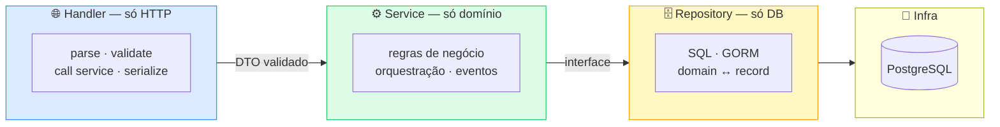

<!-- NAVIGATION BAR -->
<div align="center">

**[⬅️ M06 — Autenticação](https://github.com/titi-byte-dev/gorm-crm/tree/branch-06-auth)** &nbsp;|&nbsp;
`branch-07-mvc-layers` &nbsp;|&nbsp;
**[M08 — Docker ➡️](https://github.com/titi-byte-dev/gorm-crm/tree/branch-08-docker)**

`███████░░░░░░░░░░░░░` Módulo **07 / 18** — Nível 🟢 Júnior

</div>

---

# 🏗️ Módulo 07 — Arquitectura MVC em Camadas

[](https://github.com/titi-byte-dev/gorm-crm/actions/workflows/ci.yml)
[](https://golang.org)
[](tests/unit/)
[](.)

> **O que foi construído:** O domínio Tasks completo (handler/service/repository). Formalização da arquitectura em camadas com ADR, testes unitários que provam o valor da separação — sem DB, sem HTTP.

---

## 🎯 Objetivos de Aprendizagem

Ao terminar este módulo consegues:

- [ ] Explicar a responsabilidade exacta de cada camada
- [ ] Identificar quando um código está na camada errada
- [ ] Escrever um mock de repository para testes unitários
- [ ] Testar lógica de negócio sem servidor HTTP nem DB
- [ ] Explicar Dependency Injection manual em Go

---

## ⚡ Começa já

```bash
git checkout branch-07-mvc-layers
go test ./tests/unit/...     # testes sem DB
docker-compose up -d postgres
make run
```

---

## 🗺️ A Arquitectura — Regra de Dependência



> [!IMPORTANT]
> **Regra:** as dependências só apontam para baixo. Handler → Service → Repository. Um Service que importa `fiber` é um bug de arquitectura. Um Repository que contém lógica de negócio também.

---

## 🔍 O valor das camadas — em código

<details>
<summary><strong>Ver: testar regra de negócio sem DB nem HTTP</strong></summary>

```go
// tests/unit/task_service_test.go
// Zero dependências externas — corre em < 1ms

func TestTaskService_UpdateStatus_BlocksReopeningFinalTask(t *testing.T) {
    // MockRepository — implementa task.Repository sem DB
    svc := task.NewService(newMockRepo(), events.New(10, log))

    // Criar e completar uma task
    created, _ := svc.Create(task.CreateTaskDTO{Title: "Tarefa", ...})
    svc.UpdateStatus(created.ID, task.StatusDone)

    // Tentar reabrir → deve falhar
    _, err := svc.UpdateStatus(created.ID, task.StatusTodo)
    if err == nil {
        t.Fatal("expected error — done tasks cannot be reopened")
    }
}
```

**Sem camadas, este teste seria:**
```go
// Com tudo misturado no handler:
// - Precisávamos de um servidor Fiber a correr
// - Precisávamos de PostgreSQL com dados
// - O teste demoraria ~500ms e quebraria se o DB estivesse em baixo
```

</details>

---

<details>
<summary><strong>Ver: como identificar código na camada errada</strong></summary>

```go
// ❌ Regra de negócio no Handler — errado
func (h *Handler) UpdateStatus(c *fiber.Ctx) error {
    task, _ := h.db.First(&rec, id)         // SQL no handler
    if task.Status == "done" {              // regra de negócio no handler
        return c.Status(422).JSON(...)
    }
    // ...
}

// ✅ Handler delega tudo ao Service
func (h *Handler) UpdateStatus(c *fiber.Ctx) error {
    c.BodyParser(&body)                     // só HTTP
    validate.Check(body)                    // só validação de input
    task, err := h.svc.UpdateStatus(id, body.Status)  // delega
    return response.OK(c, task)             // só serialização
}

// ✅ Regra no Service — correcto
func (s *Service) UpdateStatus(id uuid.UUID, newStatus Status) (*Task, error) {
    task, _ := s.repo.FindByID(id)          // usa interface
    if task.Status.IsFinal() {              // regra de negócio aqui
        return nil, ErrValidation
    }
    // ...
}
```

</details>

---

## 📁 Estado completo da API após este módulo

```
/api/v1/
├── auth/
│   ├── POST   /register
│   ├── POST   /login
│   ├── POST   /refresh
│   └── GET    /me
├── contacts/     ← CRUD + filtros + paginação
├── leads/        ← CRUD + state machine de status
├── deals/        ← CRUD + pipeline de stages
└── tasks/        ← CRUD + /overdue + state machine    ← NOVO
```

---

## 🎯 Desafio

Ver [CHALLENGE.md](CHALLENGE.md)

- **Nível 1** — Adiciona um `MockContactRepository` e testa `ContactService.Create` com email duplicado
- **Nível 2** — Tenta adicionar lógica de negócio ao Handler propositadamente — o que muda nos testes?
- **Nível 3** — Implementa `GET /api/v1/contacts/:id/tasks` usando a arquitectura correcta

---

## ✅ Checklist antes de avançar

- [ ] `go test ./tests/unit/...` passa — sem DB, sem servidor
- [ ] Consegues explicar porquê `task.Service` não importa `fiber`
- [ ] Entendes a diferença entre `var _ task.Repository = (*mock)(nil)` e um teste normal
- [ ] Sabes onde colocar uma nova regra de negócio (e onde NÃO colocar)

---

<!-- NAVIGATION BAR BOTTOM -->
<div align="center">

**[⬅️ M06 — Autenticação](https://github.com/titi-byte-dev/gorm-crm/tree/branch-06-auth)** &nbsp;|&nbsp;
`07 / 18` &nbsp;|&nbsp;
**[M08 — Docker ➡️](https://github.com/titi-byte-dev/gorm-crm/tree/branch-08-docker)**

</div>
