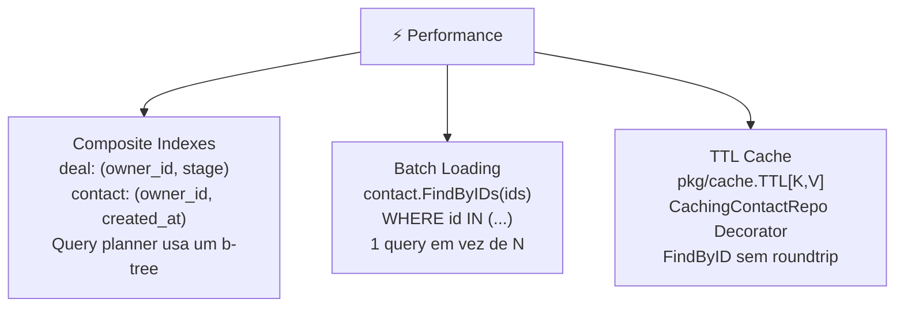

<!-- NAVIGATION BAR -->
<div align="center">

**[⬅️ M16 — Refactoring](https://github.com/titi-byte-dev/gorm-crm/tree/branch-16-refactoring)** &nbsp;|&nbsp;
`branch-17-performance` &nbsp;|&nbsp;
**[M18 — Cloud & CI/CD ➡️](https://github.com/titi-byte-dev/gorm-crm/tree/branch-18-cicd)**

`█████████████████░░░` Módulo **17 / 18** — Nível 🔴 Sénior

</div>

---

# ⚡ Módulo 17 — Performance & Cache

[](https://github.com/titi-byte-dev/gorm-crm/actions/workflows/ci.yml)
[](https://golang.org)
[](.)

> **O que foi construído:** Três intervenções de performance — composite indexes para queries frequentes, `FindByIDs` para eliminar N+1, e um TTL cache genérico com Decorator para reduzir roundtrips ao PostgreSQL.

---

## 🎯 Objetivos de Aprendizagem

Ao terminar este módulo consegues:

- [ ] Identificar queries N+1 e corrigi-las com batch loading
- [ ] Criar composite indexes GORM com `index:name,priority`
- [ ] Implementar uma cache TTL genérica com `sync.Map` e Go generics
- [ ] Compor cache + logging via Decorator sem alterar o caller

---

## ⚡ Começa já

```bash
git checkout branch-17-performance

git log --oneline branch-16-refactoring..branch-17-performance

# Índices
git show HEAD~2 -- internal/deal/repository_pg.go

# FindByIDs
git show HEAD~1 -- internal/contact/model.go

# Cache TTL
git show HEAD -- pkg/cache/ttl.go pkg/decorator/contact_cache.go
```

---

## 🗺️ As 3 Intervenções



---

## 🔍 N+1 — O Problema e a Solução

> [!IMPORTANT]
> "N+1 é o bug de performance mais comum em ORMs — e o mais silencioso."

```go
// ❌ N+1 — carregar 20 leads e depois cada contacto individualmente
leads, _ := leadRepo.FindAll(ownerID, filters)   // 1 query
for _, lead := range leads {
    contact, _ := contactRepo.FindByID(lead.ContactID)  // +20 queries
    // total: 21 queries para mostrar uma lista
}

// ✅ Batch loading — 2 queries independentes do tamanho da lista
leads, _ := leadRepo.FindAll(ownerID, filters)  // 1 query

ids := make([]uuid.UUID, len(leads))
for i, l := range leads { ids[i] = l.ContactID }

contacts, _ := contactRepo.FindByIDs(ids)  // 1 query WHERE id IN (...)
// total: 2 queries, sempre
```

**Como o GORM executa `FindByIDs`:**

```sql
SELECT * FROM contacts WHERE id IN (
    'uuid-1', 'uuid-2', 'uuid-3', ...
)
-- Uma query, independente de N
```

---

## 🔍 Composite Indexes — Porquê Importam

> [!NOTE]
> "Um índice simples em `owner_id` não basta quando a query filtra por `owner_id` AND `stage`."

```go
// A query de FindAll em deals:
// WHERE owner_id = ? AND stage = ? ORDER BY created_at

// Índice simples (owner_id):
//   → PostgreSQL usa o índice para owner_id
//   → depois faz table scan para filtrar stage
//   → complexity: O(k) onde k = deals do owner

// Índice composto (owner_id, stage):
//   → PostgreSQL usa o índice para owner_id + stage em simultâneo
//   → sem table scan adicional
//   → complexity: O(m) onde m = deals do owner com aquele stage

type dealRecord struct {
    Stage   string    `gorm:"index:idx_deals_owner_stage,priority:2"`
    OwnerID uuid.UUID `gorm:"index:idx_deals_owner_stage,priority:1"`
    // priority define a ordem das colunas no índice composto
}
```

---

## 🔍 TTL Cache — Genérica com Go Generics

> [!TIP]
> "A cache resolve o problema certo: FindByID em hot paths (ex: middleware de auth, dashboard)."

```go
// pkg/cache/ttl.go — completamente genérica
c := cache.New[uuid.UUID, *contact.Contact](5 * time.Minute)

c.Set(id, contact)
if cached, ok := c.Get(id); ok {
    return cached, nil  // sem roundtrip ao PostgreSQL
}
c.Delete(id)  // invalidação ao update/delete

// Composição com o Decorator do M15:
repo := decorator.NewContactRepoLogger(
    decorator.NewCachingContactRepo(postgresRepo, 5*time.Minute),
    logger,
)
// Logger mede o tempo → Cache serve ou delega → PostgreSQL só se necessário
```

**Invalidação:** `Save` e `Update` fazem `cache.Set` com o valor novo (warm cache). `Delete` chama `cache.Delete`. FindAll e FindByEmail nunca passam pela cache — os seus resultados dependem de estado que não controlamos facilmente.

---

## 📊 Impacto Estimado

| Intervenção | Antes | Depois |
|-------------|-------|--------|
| `FindAll` deals (owner+stage) | Index scan em owner, filter por stage | Composite index, cobertura total |
| Carregar 20 leads + contactos | 21 queries | 2 queries |
| `FindByID` em hot path (cache hit) | 1 roundtrip PostgreSQL ~1ms | Memória ~1µs |

---

## 🎯 Desafio

Ver [CHALLENGE.md](CHALLENGE.md)

- **Nível 1** — Adiciona `FindByIDs` ao `lead.Repository` e implementa com `WHERE id IN ?`
- **Nível 2** — Estende `pkg/cache.TTL` com um método `Flush()` e um `Stats() (hits, misses int64)`
- **Nível 3** — Implementa `CachingLeadRepo` e compõe `Logger(Cache(PostgresRepo))` para leads

---

## ✅ Checklist antes de avançar

- [ ] Consegues explicar quando um composite index é melhor que dois índices simples?
- [ ] Sabes identificar um N+1 num code review sem executar o código?
- [ ] Entendes por que `FindAll` e `FindByEmail` não passam pela cache?
- [ ] Consegues compor `Logger(Cache(Postgres))` a partir dos dois decorators?

---

<!-- NAVIGATION BAR BOTTOM -->
<div align="center">

**[⬅️ M16 — Refactoring](https://github.com/titi-byte-dev/gorm-crm/tree/branch-16-refactoring)** &nbsp;|&nbsp;
`17 / 18` &nbsp;|&nbsp;
**[M18 — Cloud & CI/CD ➡️](https://github.com/titi-byte-dev/gorm-crm/tree/branch-18-cicd)**

</div>
