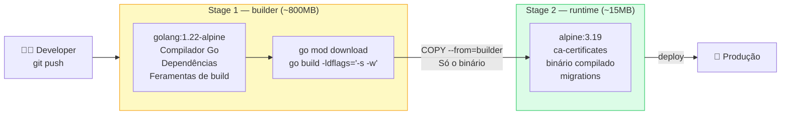

<!-- NAVIGATION BAR -->
<div align="center">

**[⬅️ M07 — Arquitectura MVC](https://github.com/titi-byte-dev/gorm-crm/tree/branch-07-mvc-layers)** &nbsp;|&nbsp;
`branch-08-docker` &nbsp;|&nbsp;
**[M09 — NoSQL & MongoDB ➡️](https://github.com/titi-byte-dev/gorm-crm/tree/branch-09-nosql)**

`████████░░░░░░░░░░░░` Módulo **08 / 18** — Nível 🟢 Júnior **→ 🏆**

</div>

---

# 🐳 Módulo 08 — Docker

[](https://github.com/titi-byte-dev/gorm-crm/actions/workflows/ci.yml)
[](Dockerfile)
[](Dockerfile)
[](.)

> **O que foi construído:** Dockerfile multi-stage (800MB builder → 15MB runtime), docker-compose com toda a stack, healthcheck real com verificação de DB, e targets `make docker/*` para o workflow diário.

---

## 🎯 Objetivos de Aprendizagem

Ao terminar este módulo consegues:

- [ ] Explicar o que é um container e porquê é diferente de uma VM
- [ ] Criar um Dockerfile multi-stage e explicar a vantagem
- [ ] Usar `docker-compose` para orquestrar múltiplos serviços
- [ ] Implementar um healthcheck que verifica dependências reais
- [ ] Explicar porquê a ordem das camadas no Dockerfile importa

---

## ⚡ Começa já

```bash
git checkout branch-08-docker

# Opção A — apenas PostgreSQL (dev com go run)
make db/up
make run

# Opção B — toda a stack em containers
make docker/up
curl http://localhost:8080/health
```

---

## 🗺️ Multi-stage Build — o porquê



---

## 🔍 Conceitos-Chave

### Ordem das camadas — cache do Docker

> [!IMPORTANT]
> O Docker invalida o cache a partir da **primeira linha que muda**. A ordem das camadas define a eficiência do build.

```dockerfile
# ✅ Correcto — dependências antes do código
COPY go.mod go.sum ./
RUN go mod download        # ← cacheia aqui (muda raramente)
COPY . .                   # ← código (muda frequentemente)
RUN go build ...

# ❌ Errado — invalida cache em cada mudança de código
COPY . .
RUN go mod download        # recorre sempre que qualquer ficheiro muda
RUN go build ...
```

**Impacto:** build com cache ~3s vs sem cache ~35s.

---

### depends_on com healthcheck

<details>
<summary><strong>Ver: porquê service_healthy em vez de apenas depends_on</strong></summary>

```yaml
# ❌ depends_on simples — começa quando o container inicia, não quando está pronto
depends_on:
  - postgres

# ✅ depends_on com healthcheck — aguarda que o postgres esteja realmente pronto
depends_on:
  postgres:
    condition: service_healthy
```

**O que acontece sem `service_healthy`:**
1. Docker inicia o container do postgres
2. Docker inicia imediatamente o container da api
3. A api tenta ligar ao DB nos primeiros 2 segundos
4. O postgres ainda está a inicializar → ligação falha → container da api morre

**Com `service_healthy`:**
1. Docker inicia postgres
2. Aguarda que `pg_isready` retorne OK (healthcheck)
3. Só então inicia a api
4. Ligação ao DB bem-sucedida

</details>

---

### Health endpoint com verificação real

<details>
<summary><strong>Ver: healthcheck que avisa quando o DB está em baixo</strong></summary>

```bash
# DB online → 200 OK
curl http://localhost:8080/health
{
  "status": "ok",
  "version": "0.8.0",
  "checks": { "database": "ok" }
}

# DB offline → 503 Service Unavailable
{
  "status": "degraded",
  "checks": { "database": "degraded" }
}
```

**Porquê 503 e não 200 quando o DB está em baixo?**

Um load balancer usa o healthcheck para decidir onde enviar tráfego.
Se a api devolve 200 mesmo com o DB em baixo, o LB continua a enviar
requests — que vão todos falhar com 500. Com 503, o LB retira este
nó do pool e redireciona para instâncias saudáveis.

</details>

---

## 📁 Ficheiros deste módulo

```
Criados:
├── Dockerfile              ← multi-stage: builder + runtime
├── .dockerignore           ← exclui .env, .git, docs do contexto
└── docs/adr/009-docker-strategy.md

Modificados:
├── docker-compose.yml      ← adiciona serviço api + depends_on correcto
├── Makefile                ← docker/build, docker/up, docker/down, docker/logs
└── cmd/api/main.go         ← health endpoint com verificação de DB
```

---

## 🏆 Marco — Programador Júnior

> [!NOTE]
> Com este módulo, o nível **Júnior** está completo.


**O que consegues agora:**
- Construir uma API REST completa com autenticação real
- Persistir dados em PostgreSQL com padrão Repository
- Contentar a app e o ambiente de desenvolvimento
- Escrever testes unitários sem infra externa
- Navegar e contribuir num repositório Git profissional

---

## 🎯 Desafio

Ver [CHALLENGE.md](CHALLENGE.md)

- **Nível 1** — Corre `make docker/build` e compara o tamanho com `golang:1.22-alpine`
- **Nível 2** — Quebra o healthcheck (para o postgres) e observa o 503
- **Nível 3** — Adiciona um `docker-compose.test.yml` para correr os testes em containers

---

## ✅ Checklist antes de avançar para Pleno

- [ ] `make docker/up` funciona — app + postgres em containers
- [ ] `curl http://localhost:8080/health` devolve `"status":"ok"` com checks
- [ ] Entendes porquê a imagem de runtime tem ~15MB e não ~800MB
- [ ] Sabes o que acontece se removeres `condition: service_healthy`

---

<!-- NAVIGATION BAR BOTTOM -->
<div align="center">

**[⬅️ M07 — Arquitectura MVC](https://github.com/titi-byte-dev/gorm-crm/tree/branch-07-mvc-layers)** &nbsp;|&nbsp;
`08 / 18` — 🏆 Júnior completo &nbsp;|&nbsp;
**[M09 — NoSQL ➡️](https://github.com/titi-byte-dev/gorm-crm/tree/branch-09-nosql)**

</div>
