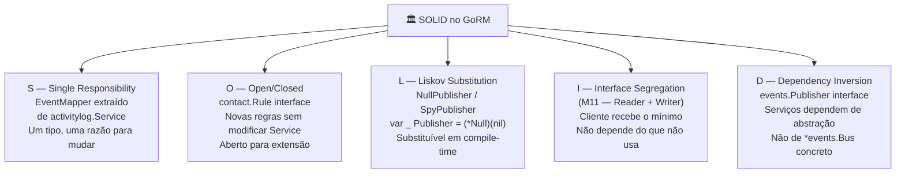

<!-- NAVIGATION BAR -->
<div align="center">

**[⬅️ M11 — OOP Avançado](https://github.com/titi-byte-dev/gorm-crm/tree/branch-11-oop)** &nbsp;|&nbsp;
`branch-12-solid` &nbsp;|&nbsp;
**[M13 — Object Calisthenics ➡️](https://github.com/titi-byte-dev/gorm-crm/tree/branch-13-calisthenics)**

`████████████░░░░░░░░` Módulo **12 / 18** — Nível 🔵 Pleno

</div>

---

# 🏛️ Módulo 12 — SOLID em Go

[](https://github.com/titi-byte-dev/gorm-crm/actions/workflows/ci.yml)
[](https://golang.org)
[](.)

> **O que foi construído:** Os 5 princípios SOLID aplicados ao GoRM — não como teoria, mas como refactors concretos em código que já existe.

---

## 🎯 Objetivos de Aprendizagem

Ao terminar este módulo consegues:

- [ ] Identificar violações de SRP, OCP, LSP, DIP no teu código
- [ ] Extrair responsabilidades para tipos dedicados (SRP)
- [ ] Adicionar comportamento sem modificar código existente (OCP)
- [ ] Escrever verificações LSP em compile-time com `var _`
- [ ] Injetar interfaces em vez de tipos concretos (DIP)
- [ ] Explicar porque ISP e DIP se complementam (M11 + M12)

---

## ⚡ Começa já

```bash
git checkout branch-12-solid

# Os 4 commits — cada um é um princípio
git log --oneline branch-11-oop..branch-12-solid

# Compara o Service antes e depois do DIP
git diff branch-11-oop..branch-12-solid -- internal/contact/service.go

# Vê o EventMapper extraído (SRP)
git show HEAD~2 -- internal/activitylog/mapper.go
```

---

## 🗺️ Os 5 Princípios no GoRM



---

## 🔍 S — Single Responsibility

> [!IMPORTANT]
> "Uma classe deve ter apenas uma razão para mudar."

```go
// ❌ Antes — service.go tinha 3 responsabilidades
func (s *Service) handleEvent(ctx context.Context, event events.Event) {
    log := &Log{Action: string(event.Type), UserID: event.UserID}
    entityType, entityID := entityFromEvent(event)  // mapeamento inline
    log.EntityType = entityType
    // ...
}

// Se o schema do Log mudar    → tenho de abrir service.go
// Se a lógica de query mudar  → tenho de abrir service.go
// Se o mapeamento mudar       → tenho de abrir service.go
```

```go
// ✅ Depois — EventMapper tem uma responsabilidade
// mapper.go
type EventMapper struct{}
func (m EventMapper) ToLog(event events.Event) *Log { ... }

// service.go
func (s *Service) handleEvent(ctx context.Context, event events.Event) {
    log := s.mapper.ToLog(event)  // delega
    s.repo.Save(log)
}

// Agora cada ficheiro tem UMA razão para mudar.
```

---

## 🔍 O — Open/Closed

> [!NOTE]
> "Aberto para extensão, fechado para modificação."

```go
// ❌ Antes — regra de negócio inline em Create
func (s *Service) Create(ownerID uuid.UUID, dto CreateContactDTO) (*Contact, error) {
    existing, _ := s.repo.FindByEmail(dto.Email)
    if existing != nil { return nil, ErrConflict }
    // Para adicionar "telefone único" tenho de MODIFICAR este método
}
```

```go
// ✅ Depois — regras como valores
type Rule interface {
    Validate(repo Reader, dto CreateContactDTO) error
}

type UniqueEmailRule struct{}
func (r UniqueEmailRule) Validate(repo Reader, dto CreateContactDTO) error { ... }

// Para adicionar nova regra: passa-a ao construtor
// Service.Create não muda — está FECHADO para modificação
contact.NewService(repo, bus,
    contact.UniqueEmailRule{},
    contact.BlockedDomainRule{"spam.com"},  // nova — sem tocar em Create
)
```

---

## 🔍 L — Liskov Substitution

> [!TIP]
> "Subtipos devem ser substituíveis pelos seus supertipos."

```go
// Em Go: qualquer tipo que satisfaça uma interface é um subtipo

// NullPublisher é substituível onde events.Publisher é esperado
type NullPublisher struct{}
func (NullPublisher) Publish(_ events.Event) {}

// Verificação LSP em compile-time — falha se a interface mudar
var _ events.Publisher = (*NullPublisher)(nil)

// Uso em testes — sem goroutines, sem estado partilhado
svc := contact.NewService(repo, testutil.NullPublisher{})
```

```go
// SpyPublisher: substituível E verificável
type SpyPublisher struct{ Events []events.Event }
func (s *SpyPublisher) Publish(e events.Event) { s.Events = append(s.Events, e) }

spy := &testutil.SpyPublisher{}
svc := contact.NewService(repo, spy)
svc.Create(ownerID, dto)
assert.True(t, spy.Published(events.ContactCreated))
```

---

## 🔍 I — Interface Segregation

> Já implementado em M11. Ver [branch-11-oop](https://github.com/titi-byte-dev/gorm-crm/tree/branch-11-oop).

```go
// Relembrar: um serviço de relatórios recebe Reader — não consegue apagar dados
func NewReportService(repo contact.Reader) *ReportService { ... }
```

---

## 🔍 D — Dependency Inversion

> [!IMPORTANT]
> "Depende de abstrações, não de concretizações."

```go
// ❌ Antes — dependência na concretização
type Service struct { bus *events.Bus }
// Para substituir o bus (Kafka, RabbitMQ, teste) tenho de mudar Service

// ✅ Depois — dependência na abstração
type Service struct { bus events.Publisher }
// Qualquer tipo com Publish(Event) serve — Bus, NullPublisher, KafkaPublisher
```

<details>
<summary>Porquê Publisher e Subscriber são interfaces separadas?</summary>

```go
// ISP + DIP juntos:
type Publisher interface { Publish(event Event) }
type Subscriber interface { Subscribe(eventType EventType, handler Handler) }

// contact.Service só publica — recebe Publisher
// activitylog.Service só subscreve — recebe Subscriber
// *events.Bus satisfaz ambas — passa em qualquer lado

// Se fossem uma interface só:
// contact.Service teria acesso a Subscribe() — que nunca usa
// Viola ISP: dependência de métodos que não usa
```

</details>

---

## 🎯 Desafio

Ver [CHALLENGE.md](CHALLENGE.md)

- **Nível 1** — Adiciona `UniquePhoneRule` a `contact` (OCP: sem modificar `Service.Create`)
- **Nível 2** — Cria `SpySubscriber` em `pkg/testutil` e verifica LSP
- **Nível 3** — Aplica o padrão Rule ao `lead.Service` para validar `ContactID` existente

---

## ✅ Checklist antes de avançar

- [ ] Consegues identificar as 3 responsabilidades que `activitylog.Service` tinha antes?
- [ ] Sabes adicionar uma nova `Rule` sem abrir `contact/service.go`?
- [ ] Entendes porque `var _ Publisher = (*Null)(nil)` verifica LSP em compile-time?
- [ ] Consegues explicar quando usar `Publisher` vs `*events.Bus` como parâmetro?

---

<!-- NAVIGATION BAR BOTTOM -->
<div align="center">

**[⬅️ M11 — OOP Avançado](https://github.com/titi-byte-dev/gorm-crm/tree/branch-11-oop)** &nbsp;|&nbsp;
`12 / 18` &nbsp;|&nbsp;
**[M13 — Object Calisthenics ➡️](https://github.com/titi-byte-dev/gorm-crm/tree/branch-13-calisthenics)**

</div>
