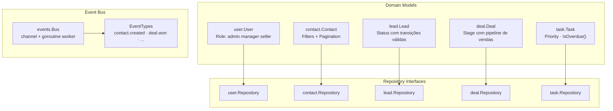
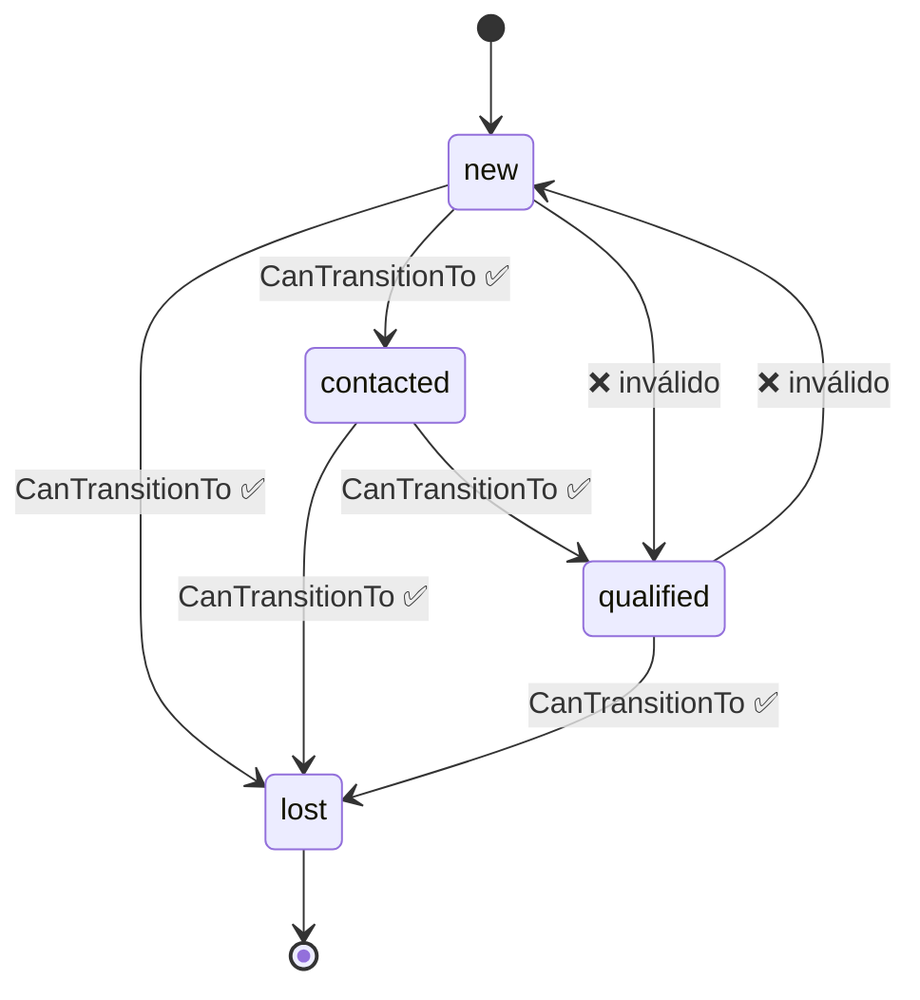
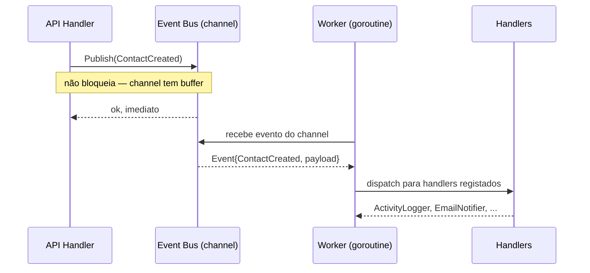
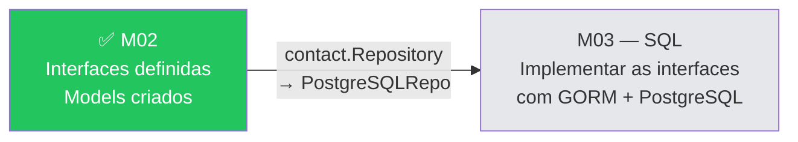

<!-- NAVIGATION BAR -->
<div align="center">

**[⬅️ M01 — Setup](https://github.com/titi-byte-dev/gorm-crm/tree/branch-01-setup)** &nbsp;|&nbsp;
`branch-02-go-fundamentos` &nbsp;|&nbsp;
**[M03 — SQL & PostgreSQL ➡️](https://github.com/titi-byte-dev/gorm-crm/tree/branch-03-sql)**

`██░░░░░░░░░░░░░░░░░░` Módulo **02 / 18** — Nível 🟢 Júnior

</div>

---

# 🔤 Módulo 02 — Fundamentos Go

[](https://github.com/titi-byte-dev/gorm-crm/actions/workflows/ci.yml)
[](https://golang.org)
[](tests/unit/)
[](.)

> **O que foi construído:** Os domain models do GoRM CRM — as structs, interfaces e lógica de negócio que representam Contactos, Leads, Deals, Tasks e Utilizadores. O Event Bus em goroutines para comunicação assíncrona.

---

## 🎯 Objetivos de Aprendizagem

Ao terminar este módulo consegues:

- [ ] Criar structs com tags JSON e perceber receivers de valor vs ponteiro
- [ ] Definir e implementar interfaces implícitas (o idioma Go)
- [ ] Usar tipos personalizados (`type Status string`) com métodos
- [ ] Lançar goroutines e comunicar via channels
- [ ] Escrever table-driven tests com `t.Parallel()`
- [ ] Distinguir quando usar `*T` (ponteiro) vs `T` (valor)

---

## ⚡ Começa já

```bash
git checkout branch-02-go-fundamentos
go test ./tests/unit/...
make run
```

---

## 🗺️ O que foi construído



---

## 🔍 Conceitos Go — Explicados com código real

### Structs e tags JSON

```go
type Deal struct {
    ID        uuid.UUID  `json:"id"`
    LeadID    *uuid.UUID `json:"lead_id,omitempty"` // pointer = opcional
    ClosedAt  *time.Time `json:"closed_at,omitempty"` // nil enquanto aberto
    CreatedAt time.Time  `json:"created_at"`
}
```

> [!NOTE]
> `*uuid.UUID` (ponteiro) em vez de `uuid.UUID` (valor) significa que o campo pode ser `nil`. Usa-se quando o campo é opcional — evita o "zero value" enganoso (`uuid.Nil`). O `omitempty` na tag JSON omite o campo quando é `nil`.

---

### Interfaces implícitas — a superpotência de Go

```go
// Definição — em contact/model.go
type Repository interface {
    FindByID(id uuid.UUID) (*Contact, error)
    Save(contact *Contact) (*Contact, error)
    // ...
}

// Implementação PostgreSQL — em contact/repository_pg.go (Módulo 03)
type postgresRepository struct{ db *gorm.DB }

func (r *postgresRepository) FindByID(id uuid.UUID) (*Contact, error) { ... }
func (r *postgresRepository) Save(contact *Contact) (*Contact, error) { ... }
// Satisfaz contact.Repository sem declaração explícita

// Mock para testes — em tests/unit/
type mockRepository struct{ contacts map[uuid.UUID]*Contact }

func (m *mockRepository) FindByID(id uuid.UUID) (*Contact, error) { ... }
// Também satisfaz contact.Repository — trocável sem alterar o Service
```

> [!IMPORTANT]
> Em Java/C# declaras `implements Repository`. Em Go, **se tens os métodos, implementas a interface** — sem palavras-chave. Isto permite criar mocks de teste para qualquer interface, incluindo de bibliotecas externas.

---

### Tipos personalizados com comportamento

<details>
<summary><strong>Ver: Estado de um Lead com transições válidas</strong></summary>

```go
type Status string

const (
    StatusNew       Status = "new"
    StatusContacted Status = "contacted"
    StatusQualified Status = "qualified"
    StatusLost      Status = "lost"
)

// CanTransitionTo encapsula as regras de negócio no tipo.
// O caller não precisa de saber quais transições são válidas.
func (s Status) CanTransitionTo(next Status) bool {
    transitions := map[Status][]Status{
        StatusNew:       {StatusContacted, StatusLost},
        StatusContacted: {StatusQualified, StatusLost},
        StatusQualified: {StatusLost},
        StatusLost:      {},           // estado final
    }
    for _, allowed := range transitions[s] {
        if allowed == next {
            return true
        }
    }
    return false
}
```



</details>

---

### Goroutines e Channels — o Event Bus

<details>
<summary><strong>Ver: Como funciona o Event Bus</strong></summary>

```go
// O Bus tem um channel com buffer — o publisher não bloqueia
type Bus struct {
    ch       chan Event  // channel com buffer de 500
    handlers map[EventType][]Handler
}

// Publish — envia para o channel sem bloquear
func (b *Bus) Publish(event Event) {
    select {
    case b.ch <- event:   // envia se houver espaço
    default:              // descarta se o channel estiver cheio
        b.logger.Warn("event bus full, dropping event")
    }
}

// Start — lança uma goroutine que processa eventos em background
func (b *Bus) Start(ctx context.Context) {
    go func() {          // "go" lança a goroutine
        for {
            select {
            case event := <-b.ch:   // recebe do channel
                b.dispatch(ctx, event)
            case <-ctx.Done():      // termina quando o contexto é cancelado
                return
            }
        }
    }()
}
```



> [!TIP]
> A goroutine vive enquanto o contexto (`ctx`) estiver ativo. Quando a app faz shutdown, `cancel()` é chamado e `ctx.Done()` fecha a goroutine de forma limpa — sem goroutine leaks.

</details>

---

### Receivers: valor vs ponteiro

```go
// Receiver de VALOR — não modifica a struct, trabalha numa cópia
func (t Task) IsOverdue() bool {
    if t.DueDate == nil { return false }
    return time.Now().After(*t.DueDate)
}

// Receiver de PONTEIRO — quando o método modifica a struct
// (veremos isto nos services do Módulo 03+)
func (f *Filters) SetDefaults() {
    if f.Page <= 0 { f.Page = 1 }  // modifica o original via ponteiro
}
```

> [!NOTE]
> Regra prática: usa receiver de **ponteiro** se o método modifica a struct ou se a struct é grande (evita cópia). Usa receiver de **valor** para operações de leitura em structs pequenas.

---

## 🧪 Testes neste módulo

```bash
go test -v ./tests/unit/...
```

<details>
<summary><strong>Ver: Exemplo de table-driven test</strong></summary>

```go
func TestLeadStatus_CanTransitionTo(t *testing.T) {
    t.Parallel()

    tests := []struct {
        name     string
        from     lead.Status
        to       lead.Status
        expected bool
    }{
        {"new can go to contacted",        lead.StatusNew,       lead.StatusContacted, true},
        {"new cannot skip to qualified",   lead.StatusNew,       lead.StatusQualified, false},
        {"lost is a final state",          lead.StatusLost,      lead.StatusNew,       false},
        // adicionar mais casos sem escrever mais código de setup
    }

    for _, tt := range tests {
        t.Run(tt.name, func(t *testing.T) {
            t.Parallel()  // cada sub-teste corre em paralelo
            got := tt.from.CanTransitionTo(tt.to)
            if got != tt.expected {
                t.Errorf("got %v, want %v", got, tt.expected)
            }
        })
    }
}
```

</details>

---

## 📁 Ficheiros deste módulo

<details>
<summary><strong>Ver ficheiros criados/modificados</strong></summary>

```
Criados:
├── internal/contact/model.go        ← Contact struct + Repository interface + Filters
├── internal/lead/model.go           ← Lead struct + Status + transições de estado
├── internal/deal/model.go           ← Deal struct + Stage + pipeline de vendas
├── internal/task/model.go           ← Task struct + Priority + IsOverdue()
├── internal/user/model.go           ← User struct + Role
├── internal/shared/events/events.go ← Event Bus: channel + goroutine worker
├── tests/unit/lead_model_test.go    ← Table-driven tests para Lead.Status
└── tests/unit/task_model_test.go    ← Table-driven tests para Task.IsOverdue

Modificados:
└── cmd/api/main.go                  ← Integra Event Bus + graceful shutdown
```

</details>

---

## 🔄 O que vem a seguir

> [!TIP]
> No **Módulo 03**, cada `Repository interface` que definiste aqui vai ganhar uma implementação real em PostgreSQL. O padrão que estabeleceste agora é o que torna tudo trocável — mocks nos testes, PostgreSQL em produção, a mesma interface.



---

## 🎯 Desafio

Ver [CHALLENGE.md](CHALLENGE.md)

- **Nível 1** — Adiciona um método `Contact.FullName()` que devolve nome + empresa
- **Nível 2** — Adiciona validação de email com regex no model (sem bibliotecas externas)
- **Nível 3** — Implementa um `MockContactRepository` que satisfaz a interface e escreve testes com ele

---

## ✅ Checklist antes de avançar

- [ ] `go test ./tests/unit/...` passa sem erros
- [ ] Entendes a diferença entre interface implícita Go vs `implements` Java/C#
- [ ] Sabes quando usar `*T` vs `T` num struct field
- [ ] Consegues explicar o que é um channel com buffer e porque não bloqueia

---

<!-- NAVIGATION BAR BOTTOM -->
<div align="center">

**[⬅️ M01 — Setup](https://github.com/titi-byte-dev/gorm-crm/tree/branch-01-setup)** &nbsp;|&nbsp;
`02 / 18` &nbsp;|&nbsp;
**[M03 — SQL & PostgreSQL ➡️](https://github.com/titi-byte-dev/gorm-crm/tree/branch-03-sql)**

</div>
