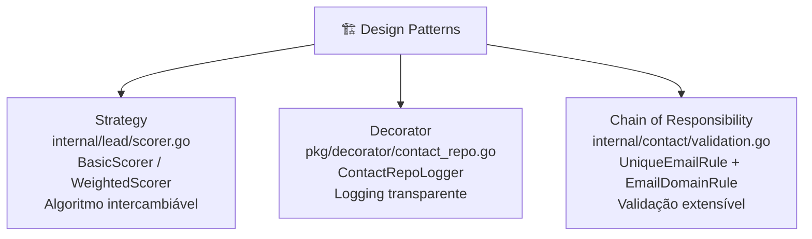

<!-- NAVIGATION BAR -->
<div align="center">

**[⬅️ M14 — Testes Automatizados](https://github.com/titi-byte-dev/gorm-crm/tree/branch-14-tests)** &nbsp;|&nbsp;
`branch-15-patterns` &nbsp;|&nbsp;
**[M16 — Refactoring ➡️](https://github.com/titi-byte-dev/gorm-crm/tree/branch-16-refactoring)**

`███████████████░░░░░` Módulo **15 / 18** — Nível 🔵 Pleno

</div>

---

# 🏗️ Módulo 15 — Design Patterns em Go

[](https://github.com/titi-byte-dev/gorm-crm/actions/workflows/ci.yml)
[](https://golang.org)
[](.)

> **O que foi construído:** Três Design Patterns aplicados a problemas reais do GoRM — Strategy para lead scoring, Decorator para logging transparente, Chain of Responsibility para validação extensível.

---

## 🎯 Objetivos de Aprendizagem

Ao terminar este módulo consegues:

- [ ] Aplicar Strategy para trocar algoritmos sem modificar o caller
- [ ] Criar um Decorator que adiciona comportamento sem alterar a interface
- [ ] Implementar Chain of Responsibility para validação extensível
- [ ] Explicar como cada padrão aplica o Open/Closed Principle

---

## ⚡ Começa já

```bash
git checkout branch-15-patterns

# Os 3 commits — cada um é um padrão
git log --oneline branch-14-tests..branch-15-patterns

# Vê o Scorer
git show HEAD~2 -- internal/lead/scorer.go

# Vê o Decorator
git show HEAD~1 -- pkg/decorator/contact_repo.go

# Vê a Chain
git show HEAD -- internal/contact/validation.go
```

---

## 🗺️ Os 3 Padrões



---

## 🔍 Strategy — lead.Scorer

> [!IMPORTANT]
> "O Service não deve saber qual algoritmo de scoring usa — só que tem um."

```go
// ❌ Antes — lógica de scoring inline no Service
func (s *Service) Score(id uuid.UUID) int {
    lead, _ := s.repo.FindByID(id)
    if lead.Value > 10000 { return 80 }
    if lead.Status == StatusQualified { return 60 }
    return 20
    // cada novo critério modifica este método
}

// ✅ Depois — Strategy pattern
type Scorer interface {
    Score(lead *Lead) int
}

// BasicScorer, WeightedScorer — algoritmos separados, intercambiáveis
svc := lead.NewService(repo, bus)                        // BasicScorer por omissão
svc := lead.NewService(repo, bus, WeightedScorer{...})   // scorer injectado
```

**Por que variadic em vez de `*Scorer`?**

```go
// Ponteiro opcional → nil check em produção
func NewService(repo Repository, bus *events.Bus, scorer *Scorer) *Service {
    if scorer == nil { ... } // fácil esquecer
}

// Variadic → compilador garante que scorer nunca é nil
func NewService(repo Repository, bus *events.Bus, scorer ...Scorer) *Service {
    s.scorer = BasicScorer{}         // default
    if len(scorer) > 0 { s.scorer = scorer[0] }
}
```

---

## 🔍 Decorator — ContactRepoLogger

> [!NOTE]
> "Adicionar logging sem tocar na implementação — e sem que o caller saiba."

```go
// Decorator envolve qualquer contact.Repository
type ContactRepoLogger struct {
    inner  contact.Repository  // pode ser postgres, mock, ou outro decorator
    logger *slog.Logger
}

// Cada método: log → delega → log resultado
func (d *ContactRepoLogger) Save(c *contact.Contact) (*contact.Contact, error) {
    start := time.Now()
    result, err := d.inner.Save(c)   // delega
    d.log("Save", time.Since(start), err)
    return result, err
}

// NewContactRepoLogger devolve contact.Repository — não o tipo concreto
// O caller só vê a interface
func NewContactRepoLogger(inner contact.Repository, logger *slog.Logger) contact.Repository
```

**Composição em cadeia:**

```go
// Decorators são composíveis — sem modificar nenhum dos componentes
repo := decorator.NewContactRepoLogger(
    decorator.NewCachingContactRepo(postgresRepo, cache),
    logger,
)
```

---

## 🔍 Chain of Responsibility — contact.Chain

> [!TIP]
> "Cada regra decide se passa ou interrompe. O Service não sabe quais existem."

```go
// ❌ Antes — validação inline, crescia com o Service
func (s *Service) Create(...) {
    existing, _ := s.repo.FindByEmail(dto.Email)
    if existing != nil { return ErrConflict }
    // próxima regra: mais um if aqui
    // próxima regra: mais um if aqui
}

// ✅ Depois — cada regra é uma struct, chain executa em sequência
type Rule interface {
    Validate(repo Reader, dto CreateContactDTO) error
}
type Chain []Rule

// DefaultChain — regras padrão
UniqueEmailRule{}  // email único
EmailDomainRule{}  // bloqueia mailinator, guerrillamail, etc.

// Chain personalizada — sem modificar o Service
svc := contact.NewService(repo, bus, UniqueEmailRule{}, MyCustomRule{})
```

**Interface segregation aplicado:**

```go
// Reader: só o que as regras precisam
type Reader interface {
    FindByEmail(email string) (*Contact, error)
}
// As regras não têm acesso a Save/Update/Delete — princípio mínimo
```

---

## 📊 Comparação dos 3 Padrões

| Padrão | Problema | Solução | Onde |
|--------|----------|---------|------|
| Strategy | Algoritmo que varia | Interface + structs intercambiáveis | `lead/scorer.go` |
| Decorator | Comportamento transversal | Wrapper com mesma interface | `pkg/decorator/` |
| Chain | Validação extensível | Lista de regras ordenadas | `contact/validation.go` |

---

## 🎯 Desafio

Ver [CHALLENGE.md](CHALLENGE.md)

- **Nível 1** — Cria `DealScorer` com Strategy para pontuar deals pelo stage + valor
- **Nível 2** — Cria `CachingContactRepo` decorator com `sync.Map` como cache de FindByID
- **Nível 3** — Adiciona `MaxContactsPerOwnerRule` à chain (limite configurável por owner)

---

## ✅ Checklist antes de avançar

- [ ] Consegues explicar quando usar Strategy vs Chain of Responsibility?
- [ ] Sabes porque `NewContactRepoLogger` devolve a interface e não o tipo concreto?
- [ ] Entendes como o Decorator aplica o Open/Closed Principle?
- [ ] Consegues adicionar uma nova `Rule` sem tocar no `contact.Service`?

---

<!-- NAVIGATION BAR BOTTOM -->
<div align="center">

**[⬅️ M14 — Testes Automatizados](https://github.com/titi-byte-dev/gorm-crm/tree/branch-14-tests)** &nbsp;|&nbsp;
`15 / 18` &nbsp;|&nbsp;
**[M16 — Refactoring ➡️](https://github.com/titi-byte-dev/gorm-crm/tree/branch-16-refactoring)**

</div>
