# 📘 PRD + SSD — GoRM: Um CRM construído em Go

> **Product Requirements Document + Study & System Design**
> Versão: 1.0 | Data: 31/05/2026

---

## Índice

1. [Visão do Produto](#1-visão-do-produto)
2. [Objetivos](#2-objetivos)
3. [Público-Alvo](#3-público-alvo)
4. [Princípios de Design do Curso](#4-princípios-de-design-do-curso)
5. [App Âncora — GoRM CRM](#5-app-âncora--gorm-crm)
6. [Estrutura de Branches](#6-estrutura-de-branches)
7. [Arquitetura do Sistema](#7-arquitetura-do-sistema)
8. [Fluxos Detalhados](#8-fluxos-detalhados)
9. [Design Patterns Aplicados](#9-design-patterns-aplicados)
10. [Pirâmide de Testes](#10-pirâmide-de-testes)
11. [Pipeline CI/CD](#11-pipeline-cicd)
12. [Plano de Módulos](#12-plano-de-módulos)
13. [Roadmap de Implementação](#13-roadmap-de-implementação)
14. [Decisões de Design (ADRs)](#14-decisões-de-design-adrs)
15. [Checklist por Módulo](#15-checklist-por-módulo)

---

## 1. Visão do Produto

**GoRM** é simultaneamente um curso de backend em Go e uma aplicação real funcional.

O estudante aprende construindo — cada módulo adiciona uma feature ao CRM, e no final do percurso tem um produto deployado, testado e documentado.

> O repositório Git **é** o curso. Cada branch representa uma etapa de aprendizagem isolada, navegável e cumulativa.

---

## 2. Objetivos

| # | Objetivo | Métrica de sucesso |
|---|----------|--------------------|
| 1 | **Primário** — O estudante constrói um CRM completo em Go do zero ao deploy | App funcional na branch-18 |
| 2 | **Secundário** — O repositório serve como material reutilizável para ensinar outros | README + docs auto-suficientes por branch |
| 3 | **Regra 80/20** — Cada módulo cobre o que aparece em 80% dos projetos reais | Sem teoria sem aplicação prática |

---

## 3. Público-Alvo

| Perfil | Descrição |
|--------|-----------|
| **Primário** | Programador experiente noutra linguagem, que quer aprender Go e consolidar arquitetura backend |
| **Secundário** | Futuros alunos (qualquer nível, graças aos módulos didáticos progressivos) |

**Pré-requisitos assumidos:**
- Experiência em pelo menos uma linguagem de programação
- Familiaridade com conceitos de programação orientada a objetos
- Conhecimento básico de linha de comandos

---

## 4. Princípios de Design do Curso

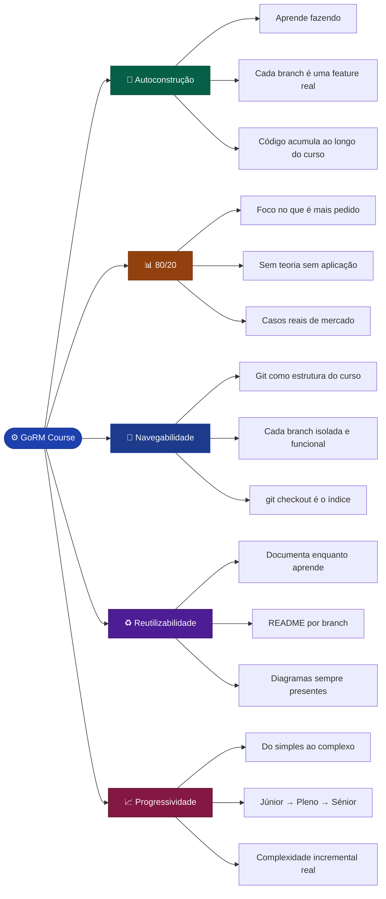

---

## 5. App Âncora — GoRM CRM

### 5.1 Porquê um CRM?

Um CRM cobre naturalmente os conceitos que aparecem em quase todos os sistemas backend reais:

| Conceito técnico | Presente no GoRM |
|------------------|-----------------|
| CRUD completo | Contactos, Leads, Deals, Tasks |
| Relações entre entidades | Cliente → Leads → Negócios → Tarefas |
| Autenticação + Roles | Vendedor, Manager, Admin |
| Estados e transições | Pipeline de vendas (Kanban) |
| Jobs assíncronos | Emails automáticos, follow-ups |
| Queries complexas | Funil de vendas, relatórios |
| Search full-text | Pesquisa de contactos |
| Multi-tenancy (avançado) | Empresas diferentes |

### 5.2 Modelo de Dados

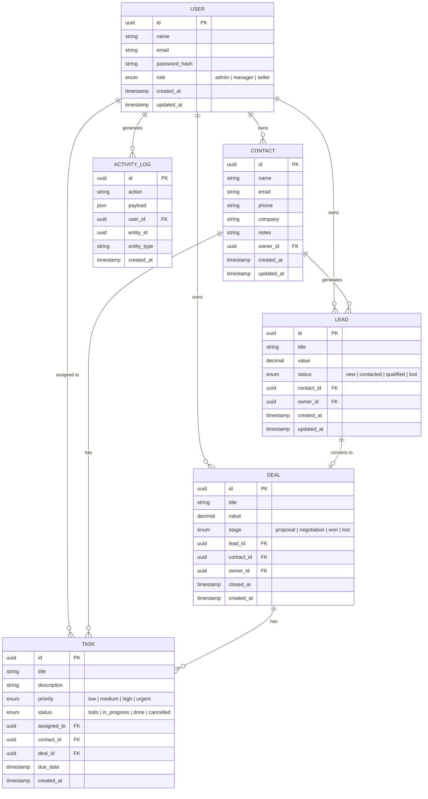

### 5.3 Pipeline de Vendas

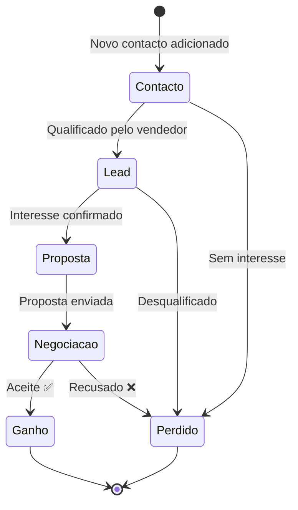

### 5.4 Roles e Permissões

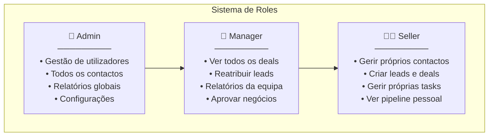

---

## 6. Estrutura de Branches

### 6.1 Visão Geral

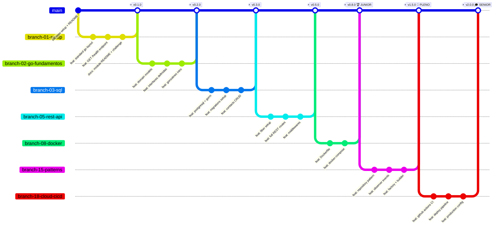

### 6.2 Tabela de Branches

| Branch | Módulo | Nível | Feature adicionada ao GoRM |
|--------|--------|-------|---------------------------|
| `branch-01-setup` | Setup & Estrutura | 🟢 Júnior | Projeto Go, estrutura de pastas, `GET /health` |
| `branch-02-go-fundamentos` | Fundamentos Go | 🟢 Júnior | Domain models, interfaces de repositório |
| `branch-03-sql` | SQL & PostgreSQL | 🟢 Júnior | CRUD de Contactos com PostgreSQL + GORM |
| `branch-04-git-workflow` | Git Workflow | 🟢 Júnior | Branching strategy, conventional commits |
| `branch-05-rest-api` | REST API | 🟢 Júnior | API REST completa (Fiber), middlewares |
| `branch-06-auth` | Autenticação & Auth | 🟢 Júnior | JWT, RBAC (admin/manager/seller) |
| `branch-07-mvc-layers` | Arquitetura MVC | 🟢 Júnior | Handler/Service/Repository separados |
| `branch-08-docker` | Docker | 🟢 **→ Júnior** | Dockerfile, docker-compose, ambiente local |
| `branch-09-nosql` | NoSQL & MongoDB | 🔵 Pleno | Activity logs em MongoDB |
| `branch-10-clean-code` | Clean Code | 🔵 Pleno | Refactor com princípios Clean Code |
| `branch-11-oop` | OOP Avançado | 🔵 Pleno | Interfaces avançadas, DRY/KISS/YAGNI |
| `branch-12-solid` | SOLID | 🔵 Pleno | SOLID aplicado ao GoRM |
| `branch-13-calisthenics` | Object Calisthenics | 🔵 Pleno | 9 regras aplicadas ao código |
| `branch-14-testes` | Testes Automatizados | 🔵 Pleno | Unit + Integration + E2E |
| `branch-15-patterns` | Design Patterns | 🔵 Pleno | Repository, Observer, Factory, Strategy |
| `branch-16-refactoring` | Técnicas de Refactoring | 🟣 Sénior | Refactor com casos reais do CRM |
| `branch-17-performance` | Performance & Cache | 🟣 Sénior | Redis, jobs assíncronos, CDN |
| `branch-18-cloud-cicd` | Cloud & CI/CD | 🟣 **→ Sénior** | Deploy AWS/GCP, GitHub Actions |

---

## 7. Arquitetura do Sistema

### 7.1 Visão de Alto Nível (C4 — Context)

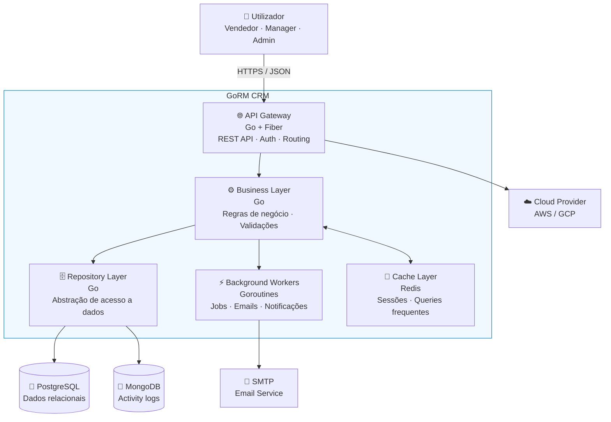

### 7.2 Estrutura Interna por Camadas

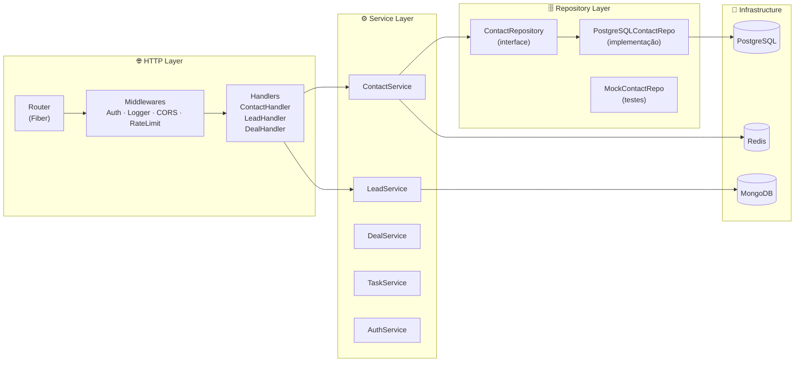

### 7.3 Estrutura de Pastas (Standard Go Layout)

```
gorm-crm/
├── cmd/
│   └── api/
│       └── main.go                  # Entry point — wire everything together
│
├── internal/                        # Código privado da aplicação
│   ├── contact/
│   │   ├── handler.go               # HTTP handlers (recebe req, devolve resp)
│   │   ├── service.go               # Business logic (regras de negócio)
│   │   ├── repository.go            # Interface do repositório
│   │   ├── repository_pg.go         # Implementação PostgreSQL
│   │   ├── model.go                 # Domain model (struct Contact)
│   │   └── dto.go                   # Request/Response DTOs
│   ├── lead/                        # mesma estrutura
│   ├── deal/                        # mesma estrutura
│   ├── task/                        # mesma estrutura
│   ├── auth/
│   │   ├── handler.go
│   │   ├── service.go
│   │   ├── jwt.go                   # Token generation + validation
│   │   └── middleware.go            # Auth middleware
│   └── shared/
│       ├── middleware/              # CORS, logger, rate limit
│       ├── errors/                  # Error types + handlers
│       ├── events/                  # Event bus (channels)
│       └── pagination/              # Query params helpers
│
├── pkg/                             # Código reutilizável (pode ser importado externamente)
│   ├── database/
│   │   ├── postgres.go              # PostgreSQL connection
│   │   └── mongodb.go               # MongoDB connection
│   ├── cache/
│   │   └── redis.go                 # Redis client
│   └── logger/
│       └── logger.go                # Structured logging (zerolog/zap)
│
├── migrations/                      # SQL migrations (golang-migrate)
│   ├── 001_create_users.up.sql
│   ├── 001_create_users.down.sql
│   └── ...
│
├── docs/                            # Documentação e diagramas
│   ├── PRD-SSD.md                   # Este documento
│   ├── adr/                         # Architecture Decision Records
│   └── modules/                     # Docs detalhadas por módulo
│
├── tests/
│   ├── unit/                        # Testes unitários (mocks)
│   ├── integration/                 # Testes com DB real (testcontainers)
│   └── e2e/                         # Testes end-to-end via HTTP
│
├── docker-compose.yml               # PostgreSQL + MongoDB + Redis local
├── docker-compose.test.yml          # Stack para testes CI
├── Dockerfile                       # Multi-stage build
├── Makefile                         # make run | test | migrate | lint
├── .env.example                     # Variáveis de ambiente necessárias
├── .github/
│   └── workflows/
│       ├── ci.yml                   # CI pipeline
│       └── deploy.yml               # CD pipeline
└── README.md
```

---

## 8. Fluxos Detalhados

### 8.1 Fluxo de Autenticação (Módulo 06)

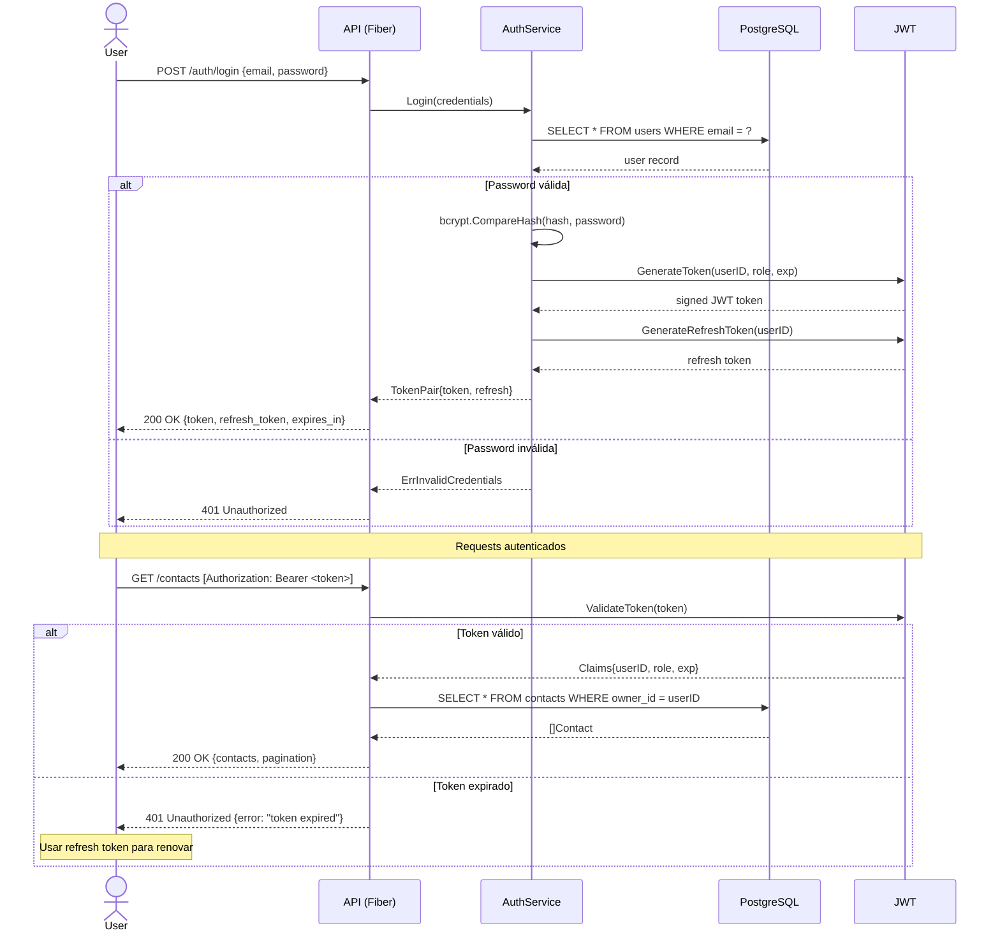

### 8.2 Fluxo CRUD Completo — Repository Pattern (Módulo 07 + 15)

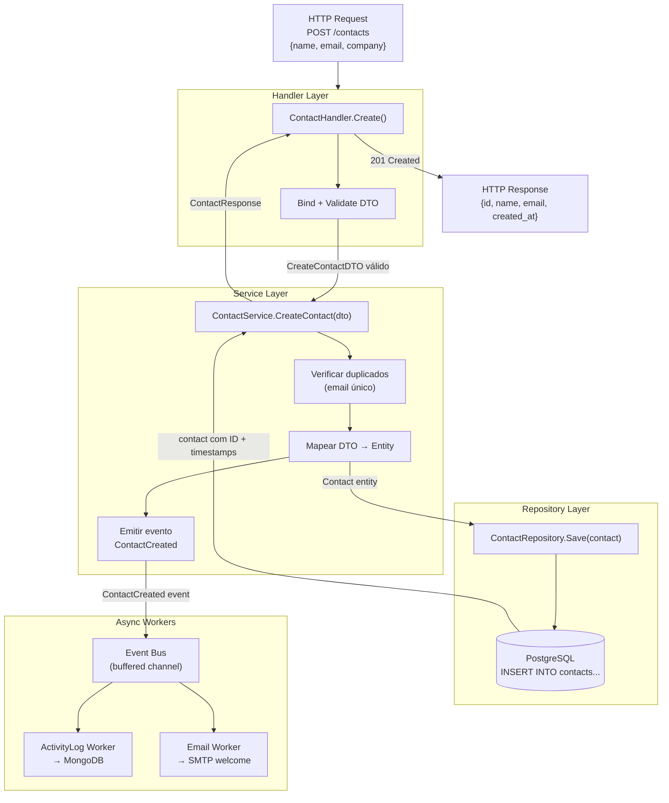

### 8.3 Cache-Aside Pattern (Módulo 17)

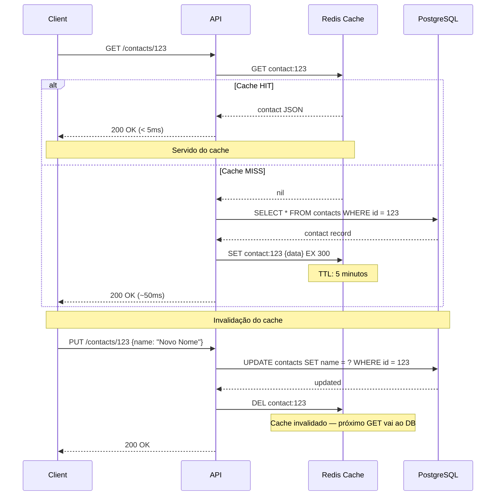

### 8.4 Jobs Assíncronos com Goroutines (Módulo 17)

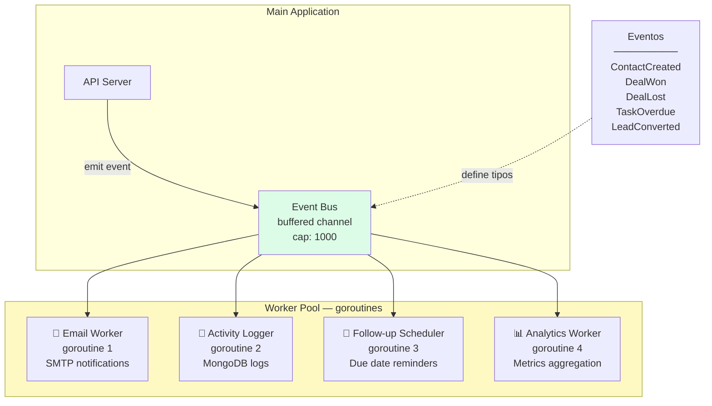

---

## 9. Design Patterns Aplicados

```mermaid
flowchart TD
    ROOT(["🎨 Design Patterns no GoRM"])

    ROOT --> CR["🏗️ Criacionais"]
    ROOT --> ES["🔗 Estruturais"]
    ROOT --> CO["⚡ Comportamentais"]

    CR --> CR1["Factory\n─ ContactFactory\n─ LeadFactory\n─ UserFactory (testes)"]
    CR --> CR2["Builder\n─ QueryBuilder (filtros)\n─ EmailBuilder (templates)"]
    CR --> CR3["Singleton\n─ DB Connection pool\n─ Redis client"]

    ES --> ES1["Repository\n─ ContactRepository interface\n─ LeadRepository interface\n─ Impl PG + Mock"]
    ES --> ES2["Adapter\n─ EmailAdapter\n─ SMTPAdapter\n─ SendGridAdapter"]
    ES --> ES3["Decorator\n─ LoggingMiddleware\n─ AuthMiddleware\n─ RateLimitMiddleware"]
    ES --> ES4["Facade\n─ CRMFacade"]

    CO --> CO1["Observer\n─ Event Bus\n─ ActivityLog listener\n─ Email listener"]
    CO --> CO2["Strategy\n─ Pipeline Stage\n─ Pricing\n─ Export CSV/JSON"]
    CO --> CO3["Command\n─ Undo tasks\n─ Bulk operations"]
    CO --> CO4["Chain of Resp.\n─ Middleware pipeline\n─ Validation chain"]
    CO --> CO5["Template Method\n─ Base Report\n─ SalesReport\n─ ActivityReport"]

    style ROOT fill:#1e40af,color:#fff
    style CR fill:#065f46,color:#fff
    style ES fill:#92400e,color:#fff
    style CO fill:#4c1d95,color:#fff
```

### 9.1 Repository Pattern em Go

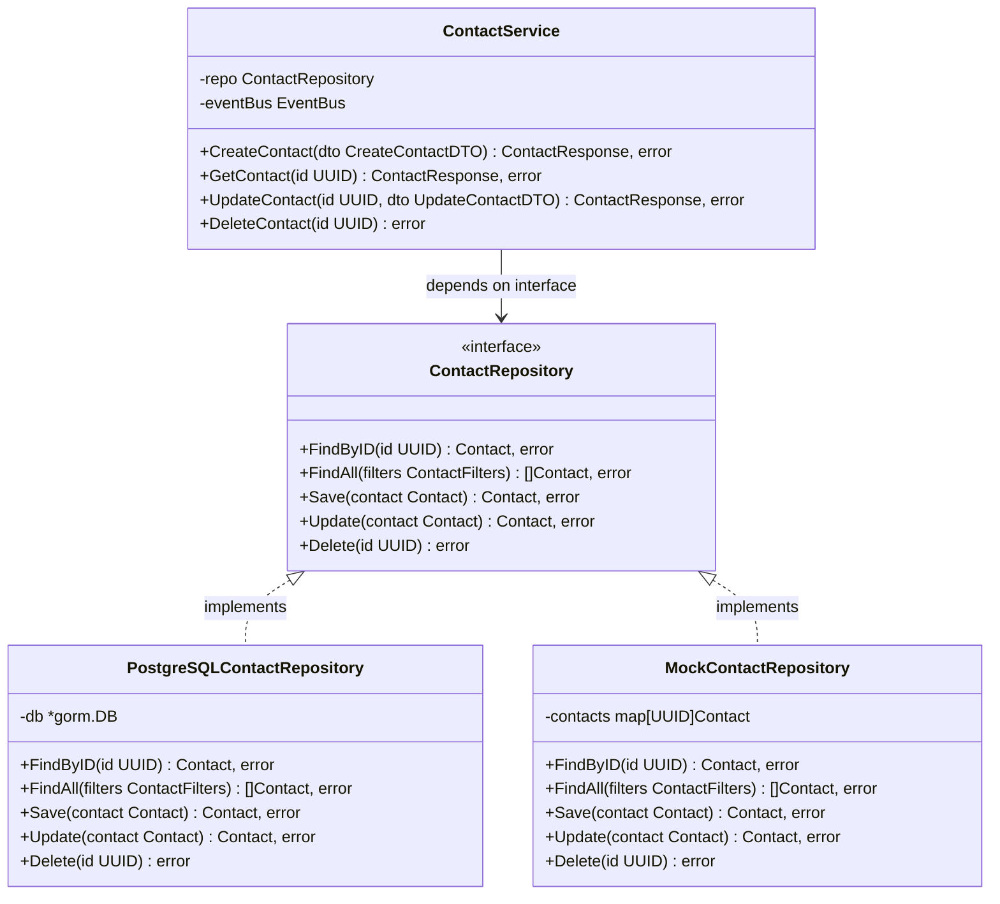

---

## 10. Pirâmide de Testes

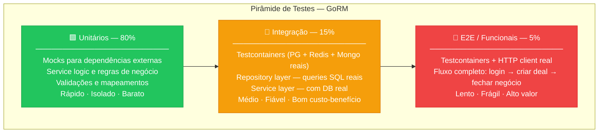

### 10.1 Estratégia de Testes por Módulo

| Módulo | Tipo de testes introduzidos | Ferramenta |
|--------|----------------------------|------------|
| M03+ | Unitários básicos | `testing` nativo + `testify` |
| M06 | Testes de auth (JWT) | `testify/mock` |
| M14 | Integração com DB | `testcontainers-go` |
| M14 | E2E via HTTP | `net/http/httptest` |
| M17 | Benchmarks | `testing.B` |

---

## 11. Pipeline CI/CD

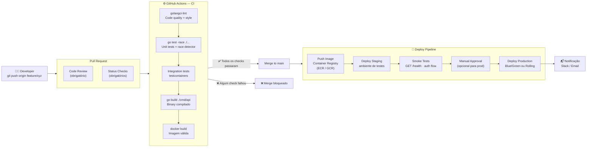

---

## 12. Plano de Módulos

### Módulo 01 — Setup & Estrutura Go

**Branch:** `branch-01-setup`
**Feature no GoRM:** Projeto Go inicializado, `GET /health` funcional
**Duração estimada:** 3 dias

**Conteúdo:**
- Instalar Go 1.22+, configurar workspace
- Standard Go layout — porquê esta estrutura
- `go mod init`, `go.mod`, `go.sum`
- Primeiro handler HTTP com Fiber
- Makefile para comandos comuns

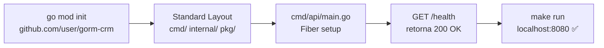

---

### Módulo 02 — Fundamentos Go

**Branch:** `branch-02-go-fundamentos`
**Feature no GoRM:** Domain models definidos, interfaces de repositório criadas
**Duração estimada:** 5 dias

**Conteúdo (80/20 Go para quem vem de outra linguagem):**
- Structs, interfaces, embedding vs herança
- Error handling idiomático (`error` como valor, não exceção)
- Goroutines e channels — introdução prática
- `defer`, `panic`, `recover`
- Ponteiros vs valores — quando usar cada um
- Generics — introdução com casos reais

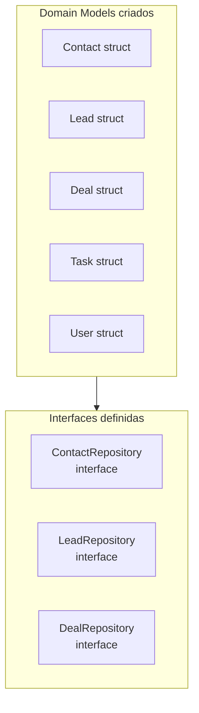

---

### Módulo 03 — SQL & PostgreSQL

**Branch:** `branch-03-sql`
**Feature no GoRM:** CRUD completo de Contactos persistido em PostgreSQL
**Duração estimada:** 5 dias

**Conteúdo:**
- PostgreSQL setup com Docker
- GORM — models, migrations, associations
- `golang-migrate` para versioning de schema
- CRUD de Contacts com todos os campos
- Transações ACID — quando e como usar
- Query com filtros, ordenação e paginação
- Índices — porque importam para performance

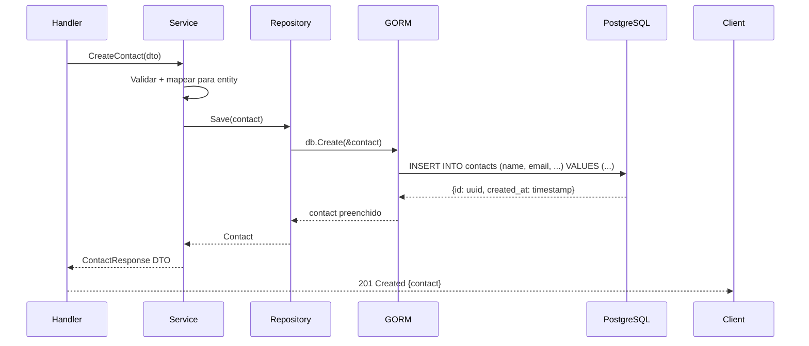

---

### Módulo 07 — Arquitetura MVC em Camadas

**Branch:** `branch-07-mvc-layers`
**Feature no GoRM:** Todos os domínios separados em Handler/Service/Repository
**Duração estimada:** 4 dias

**Conteúdo:**
- Separação de responsabilidades — porquê interessa
- Handler layer — só HTTP, nada de negócio
- Service layer — regras de negócio, sem HTTP
- Repository layer — só acesso a dados, sem negócio
- DTOs vs Domain Models — a fronteira
- Dependency Injection manual (constructors)

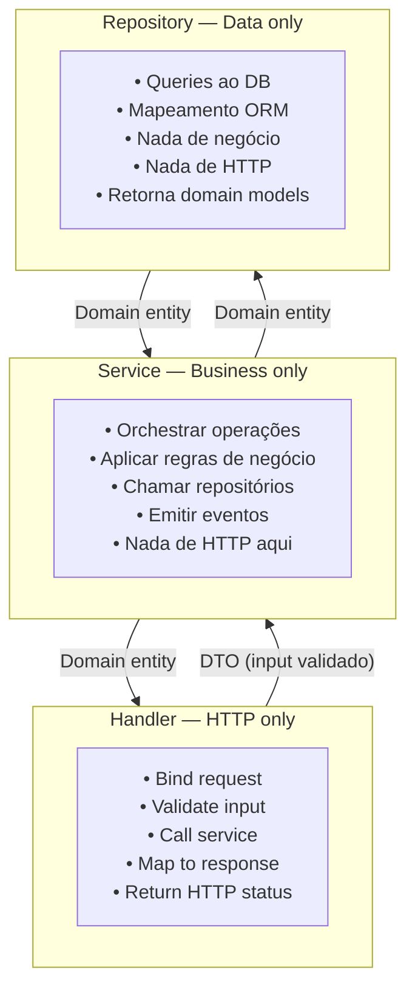

---

### Módulo 12 — SOLID em Go

**Branch:** `branch-12-solid`
**Feature no GoRM:** Refactor da codebase aplicando os 5 princípios
**Duração estimada:** 5 dias

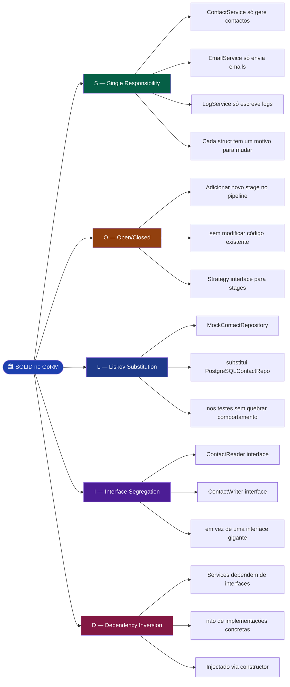

---

### Módulo 14 — Testes Automatizados

**Branch:** `branch-14-testes`
**Feature no GoRM:** Cobertura completa da pirâmide de testes
**Duração estimada:** 5 dias

**Conteúdo:**
- Testes unitários com `testify` e mocks manuais
- Testes de integração com `testcontainers-go`
- Testes E2E com `httptest`
- Table-driven tests (idioma Go)
- Test coverage — `go test -cover`
- Race detector — `go test -race`
- Benchmarks — `go test -bench`

---

### Módulo 15 — Design Patterns

**Branch:** `branch-15-patterns`
**Feature no GoRM:** 10+ patterns aplicados a casos reais
**Duração estimada:** 6 dias

**Patterns e onde aparecem no GoRM:**

| Pattern | Categoria | Onde no GoRM |
|---------|-----------|--------------|
| Repository | Estrutural | `ContactRepository`, `DealRepository` |
| Factory | Criacional | `ContactFactory`, `UserFactory` (testes) |
| Builder | Criacional | `QueryBuilder` para filtros/paginação |
| Observer | Comportamental | `EventBus` para `ActivityLog` e emails |
| Strategy | Comportamental | Pipeline stages, export formats |
| Decorator | Estrutural | `LoggingMiddleware`, `AuthMiddleware` |
| Singleton | Criacional | DB connection pool, Redis client |
| Command | Comportamental | Undo em tasks, bulk operations |
| Facade | Estrutural | `CRMService` agrega sub-serviços |
| Adapter | Estrutural | `EmailAdapter` (SMTP vs SendGrid) |

---

## 13. Roadmap de Implementação

```mermaid
gantt
    title GoRM — Plano de Construção (estimativa self-paced)
    dateFormat  YYYY-MM-DD
    section Nível Júnior
    M01 Setup e Estrutura        :m01, 2026-06-01, 3d
    M02 Fundamentos Go           :m02, after m01, 5d
    M03 SQL e PostgreSQL         :m03, after m02, 5d
    M04 Git Workflow             :m04, after m03, 2d
    M05 REST API                 :m05, after m04, 5d
    M06 Autenticação             :m06, after m05, 4d
    M07 Arquitetura MVC          :m07, after m06, 4d
    M08 Docker                   :m08, after m07, 3d
    section Nível Pleno
    M09 NoSQL MongoDB            :m09, after m08, 4d
    M10 Clean Code               :m10, after m09, 4d
    M11 OOP Avançado             :m11, after m10, 4d
    M12 SOLID                    :m12, after m11, 5d
    M13 Object Calisthenics      :m13, after m12, 3d
    M14 Testes Automatizados     :m14, after m13, 5d
    M15 Design Patterns          :m15, after m14, 6d
    section Nível Sénior
    M16 Refactoring              :m16, after m15, 4d
    M17 Performance e Cache      :m17, after m16, 5d
    M18 Cloud e CI/CD            :m18, after m17, 5d
```

**Total estimado:** ~80 horas de estudo autodirigido (~31 dias úteis)

---

## 14. Decisões de Design (ADRs)

Ver pasta [`docs/adr/`](adr/) para os registos completos.

| ADR | Decisão | Estado |
|-----|---------|--------|
| [ADR-001](adr/001-http-framework.md) | Usar Fiber como framework HTTP | ✅ Aceite |
| [ADR-002](adr/002-orm-strategy.md) | GORM nos módulos iniciais, sqlx no de performance | ✅ Aceite |
| [ADR-003](adr/003-branch-strategy.md) | Branches cumulativas (cada uma parte da anterior) | ✅ Aceite |
| [ADR-004](adr/004-dependency-injection.md) | Manual DI nos primeiros módulos, Wire introduzido mais tarde | ✅ Aceite |
| [ADR-005](adr/005-error-handling.md) | Errors como valores (idioma Go), sem panic em produção | ✅ Aceite |
| [ADR-006](adr/006-testing-strategy.md) | Testcontainers para integração, mocks manuais para unitários | ✅ Aceite |

---

## 15. Checklist por Módulo

Cada branch/módulo deve ter obrigatoriamente:

```
[ ] README.md com:
    [ ] Objetivo claro do módulo
    [ ] Lista de conceitos abordados
    [ ] O que vais construir (feature no GoRM)
    [ ] Diagrama Mermaid de contexto
    [ ] Pré-requisitos (branch anterior)
    [ ] Recursos e referências

[ ] Código Go:
    [ ] Funcional e testável
    [ ] Segue a estrutura de pastas definida
    [ ] Incremento sobre a branch anterior
    [ ] go vet e golangci-lint sem erros

[ ] Testes (a partir do M03):
    [ ] Mínimo unitários para a nova lógica
    [ ] Integração quando há acesso a DB

[ ] Documentação:
    [ ] CHALLENGE.md com exercício prático
    [ ] ADR se houve decisão de design relevante
    [ ] Comentários no código apenas onde necessário

[ ] Git:
    [ ] Conventional commits ao longo do módulo
    [ ] git tag vX.X no final
    [ ] PR documentado para merge em main
```

---

## Resumo Executivo

| Dimensão | Detalhe |
|----------|---------|
| **Nome** | GoRM — Um CRM construído em Go |
| **Total de módulos** | 18 módulos em 3 níveis |
| **Duração estimada** | ~80 horas (self-paced) |
| **Estrutura** | 1 branch Git por módulo, cumulativas |
| **App produzida** | CRM completo: contactos, leads, deals, tasks, auth, cache, deploy |
| **Stack** | Go + Fiber + PostgreSQL + MongoDB + Redis + Docker + GitHub Actions |
| **Nível de entrada** | Programador experiente noutra linguagem |
| **Nível de saída** | Backend Sénior em Go com visão de arquitetura |
| **Reutilizabilidade** | Repositório auto-suficiente para ensinar outros |

---

> *"O melhor código é o código que tu próprio construíste, entendes e consegues explicar."*
