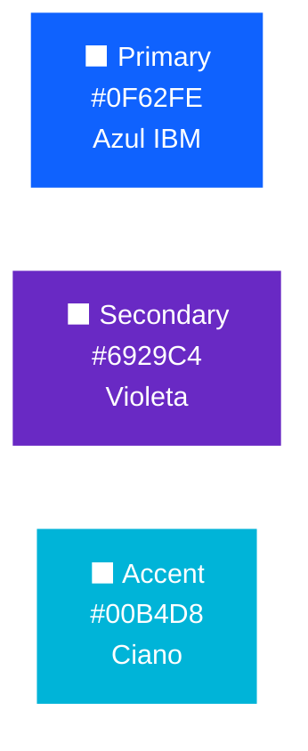
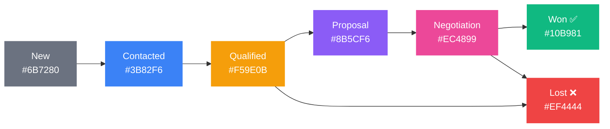
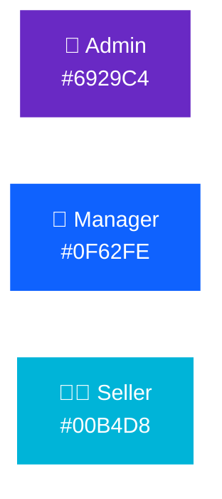
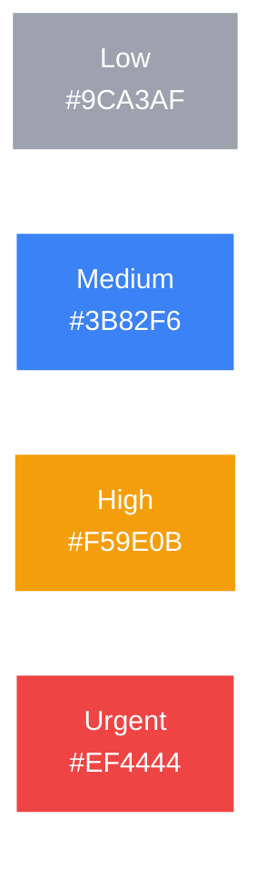
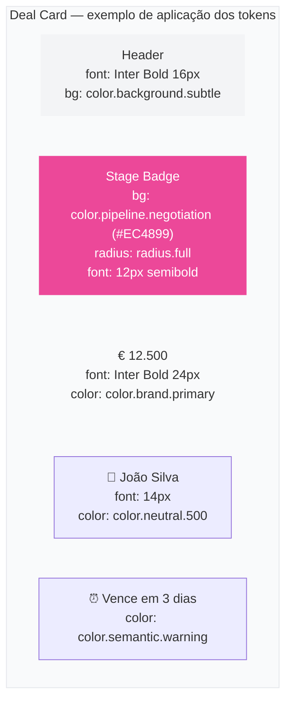

# 🎨 GoRM CRM — Design System

> Tokens de design do produto GoRM CRM.
> Framework-agnostic — definidos uma vez, consumíveis por qualquer frontend.

---

## Identidade Visual

**GoRM** é um CRM profissional construído em Go. A identidade visual reflete os valores do produto:

| Valor | Expressão visual |
|-------|-----------------|
| **Técnico mas acessível** | Tipografia clara (Inter), espaçamentos generosos |
| **Confiança** | Azul primário — associado a profissionalismo e fiabilidade |
| **Energia** | Violeta secundário — diferenciador, não genérico |
| **Clareza** | Hierarquia visual forte, nunca decoração por decoração |

---

## Paleta de Cores

### Brand



### Pipeline de Vendas — Cores por Estado

Cada estado do pipeline tem uma cor semântica que comunica progresso e urgência:



### Roles de Utilizador



### Prioridade de Tarefas



---

## Tipografia

| Role | Font | Tamanho | Peso |
|------|------|---------|------|
| Headings | Inter | 24–36px | 700 |
| Body | Inter | 16px | 400 |
| Labels / Meta | Inter | 12–14px | 500 |
| Código | JetBrains Mono | 14px | 400 |

---

## Escala de Espaçamento

Base unit: **4px**

| Token | Valor | Uso típico |
|-------|-------|-----------|
| `spacing.1` | 4px | Padding interno de ícone |
| `spacing.2` | 8px | Gap entre elementos inline |
| `spacing.4` | 16px | Padding de card, espaço entre campos |
| `spacing.6` | 24px | Padding de secção |
| `spacing.8` | 32px | Margem entre blocos |
| `spacing.16` | 64px | Padding de página |

---

## Border Radius

| Token | Valor | Uso |
|-------|-------|-----|
| `radius.sm` | 4px | Badges, tags |
| `radius.base` | 6px | Inputs, botões |
| `radius.md` | 8px | Cards |
| `radius.lg` | 12px | Modals, drawers |
| `radius.full` | 9999px | Pills, avatares |

---

## Anatomia de um Card de Deal



---

## Como consumir os tokens

Os tokens estão em [`tokens.json`](tokens.json) num formato standard.

### CSS Custom Properties (quando houver frontend)
```css
:root {
  --color-brand-primary:   #0F62FE;
  --color-pipeline-won:    #10B981;
  --color-pipeline-lost:   #EF4444;
  --font-sans:             'Inter', system-ui, sans-serif;
  --font-mono:             'JetBrains Mono', monospace;
  --spacing-4:             16px;
  --radius-md:             8px;
}
```

### Tailwind Config (quando houver frontend)
```js
// tailwind.config.js
module.exports = {
  theme: {
    extend: {
      colors: {
        brand: { primary: '#0F62FE', secondary: '#6929C4' },
        pipeline: {
          new: '#6B7280', contacted: '#3B82F6',
          won: '#10B981',  lost: '#EF4444',
        }
      }
    }
  }
}
```

### API — Campos de cor nas respostas
O backend devolve o `stage`/`status` como string. O frontend faz o mapeamento local usando os tokens. A API **nunca devolve cores** — separação de responsabilidades.

```json
{ "stage": "negotiation" }
// Frontend mapeia: "negotiation" → color.pipeline.negotiation → #EC4899
```

---

## Mermaid Theme para Diagramas do Curso

Todos os diagramas do curso usam esta paleta para consistência:

```
Júnior  → #22c55e (verde)
Pleno   → #3b82f6 (azul)
Sénior  → #a855f7 (violeta)
Neutro  → #e5e7eb (cinzento claro)
```

---

## Ficheiros

| Ficheiro | Conteúdo |
|----------|----------|
| [`tokens.json`](tokens.json) | Todos os tokens em formato standard |
| [`README.md`](README.md) | Este documento — preview visual |

> Quando o frontend for construído, os tokens são importados diretamente deste ficheiro — zero retrabalho.
