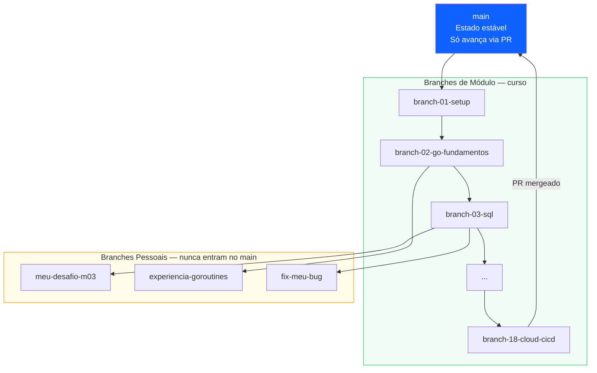
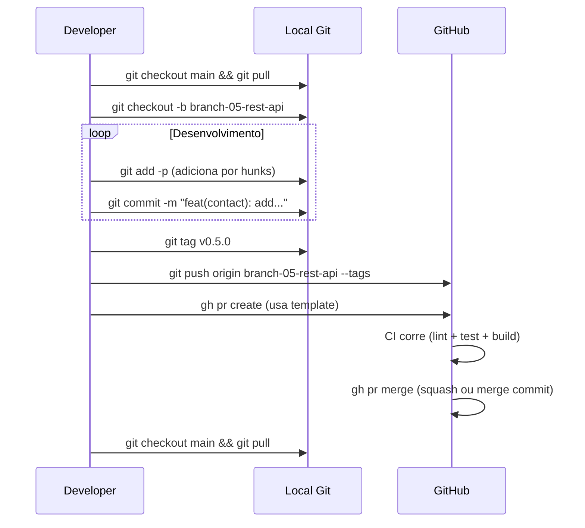

# 🌿 Git Workflow — GoRM CRM

Guia de referência rápida para o workflow Git do projeto.

---

## Estrutura de Branches



---

## Conventional Commits

### Formato

```
<tipo>(<escopo>): <descrição curta>

[body opcional — explica o PORQUÊ]

[footer opcional — BREAKING CHANGE, Refs]
```

### Exemplos reais do projeto

```bash
# Nova feature
feat(contact): add search endpoint with company filter

# Bug fix com contexto
fix(auth): handle expired refresh token correctly

Tokens were not being invalidated on logout, allowing reuse
after expiry. Added token blacklist in Redis.

# Refactor explicado
refactor(deal): extract stage transition logic to service

Stage validation was duplicated in handler and service.
Single source of truth now in DealService.canTransition().

# Docs
docs(m04): add git workflow guide and commit template

# Chore
chore: update fiber to v2.52.13 to fix CVE-2024-XXXX
```

### Tipos disponíveis

| Tipo | Emoji | Quando usar |
|------|-------|-------------|
| `feat` | ✨ | Nova feature, novo endpoint |
| `fix` | 🐛 | Correção de bug |
| `refactor` | ♻️ | Reorganização sem mudar comportamento |
| `test` | 🧪 | Adicionar ou corrigir testes |
| `docs` | 📝 | README, diagramas, ADRs, comentários |
| `chore` | 🔧 | Dependências, config, Makefile |
| `perf` | ⚡ | Melhorias de performance |
| `ci` | 🔄 | GitHub Actions, deploy scripts |
| `style` | 🎨 | Formatação, sem mudança de lógica |

---

## Fluxo Completo de um Módulo



---

## Comandos de Referência Rápida

### Navegar entre módulos

```bash
# Ver todos os módulos
git branch -a | grep branch-

# Ir para um módulo
git checkout branch-07-mvc-layers

# Ver o que mudou neste módulo
git diff branch-06-auth..branch-07-mvc-layers

# Ver só os ficheiros alterados
git diff --name-only branch-06-auth..branch-07-mvc-layers

# Ver o log do módulo
git log --oneline branch-06-auth..branch-07-mvc-layers
```

### Trabalhar num desafio

```bash
# Criar branch de desafio a partir do módulo atual
git checkout branch-03-sql
git checkout -b meu-desafio-m03

# Trabalhar...
git add -p                    # adicionar por hunks (recomendado)
git commit -m "feat: add stats endpoint for challenge"

# Comparar com a solução do módulo
git diff branch-03-sql..meu-desafio-m03
```

### Ativação do commit template

```bash
# Configura o template para este repositório
git config commit.template .gitmessage

# A partir de agora, git commit (sem -m) abre o template no editor
git commit
```

---

## Configurar o Template de Commit

Após clonar o repositório, ativa o template uma vez:

```bash
git config commit.template .gitmessage
```

Depois usa `git commit` (sem `-m`) e o template aparece no editor com os tipos e exemplos.

---

## Tags e Versões

| Tag | Branch | Marco |
|-----|--------|-------|
| `v0.1.0` | branch-01-setup | Projeto inicializado |
| `v0.2.0` | branch-02-go-fundamentos | Domain models |
| `v0.3.0` | branch-03-sql | CRUD PostgreSQL |
| `v0.4.0` | branch-04-git-workflow | Este módulo |
| `v0.8.0` | branch-08-docker | 🏆 Júnior completo |
| `v1.5.0` | branch-15-patterns | 🎯 Pleno completo |
| `v2.0.0` | branch-18-cloud-cicd | 🎓 Sénior completo |
