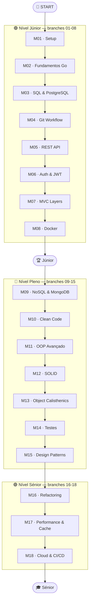

# Módulos do Curso — Visão Geral

Cada módulo tem a sua própria branch, README e CHALLENGE. Esta página serve de índice rápido.

---

## Mapa de Progressão



---

## Índice

### 🟢 Nível Júnior

| # | Branch | Conceitos chave | Feature no GoRM |
|---|--------|-----------------|-----------------|
| 01 | `branch-01-setup` | Go layout, go modules, Makefile | `GET /health` |
| 02 | `branch-02-go-fundamentos` | Structs, interfaces, goroutines, errors | Domain models |
| 03 | `branch-03-sql` | PostgreSQL, GORM, migrations, CRUD | CRUD Contactos |
| 04 | `branch-04-git-workflow` | Branching, conventional commits, PRs | Git workflow |
| 05 | `branch-05-rest-api` | Fiber, REST, middlewares, paginação | API REST completa |
| 06 | `branch-06-auth` | JWT, bcrypt, RBAC, refresh tokens | Auth + Roles |
| 07 | `branch-07-mvc-layers` | Handler/Service/Repository, DTOs, DI | Camadas separadas |
| 08 | `branch-08-docker` | Dockerfile, docker-compose, multi-stage | App containerizada |

### 🔵 Nível Pleno

| # | Branch | Conceitos chave | Feature no GoRM |
|---|--------|-----------------|-----------------|
| 09 | `branch-09-nosql` | MongoDB, document store, activity logs | Histórico de ações |
| 10 | `branch-10-clean-code` | Nomes claros, funções pequenas, sem duplicação | Refactor geral |
| 11 | `branch-11-oop` | Embedding, composição, DRY/KISS/YAGNI | Interfaces avançadas |
| 12 | `branch-12-solid` | S/O/L/I/D em Go com casos reais | Refactor SOLID |
| 13 | `branch-13-calisthenics` | 9 regras Object Calisthenics | Código mais expressivo |
| 14 | `branch-14-testes` | Unitários, integração, E2E, testcontainers | Cobertura completa |
| 15 | `branch-15-patterns` | Repository, Observer, Factory, Strategy... | 10+ patterns |

### 🟣 Nível Sénior

| # | Branch | Conceitos chave | Feature no GoRM |
|---|--------|-----------------|-----------------|
| 16 | `branch-16-refactoring` | Extract method, Replace conditional, Move field | Codebase limpa |
| 17 | `branch-17-performance` | Redis, Cache-Aside, goroutines, benchmarks | Cache + workers |
| 18 | `branch-18-cloud-cicd` | GitHub Actions, Docker registry, deploy | CI/CD completo |

---

## Anatomia de cada branch

```
branch-XX-nome/
├── README.md          ← objetivo, conceitos, diagrama
├── CHALLENGE.md       ← exercício prático do módulo
├── internal/          ← código Go (incremento sobre módulo anterior)
├── docs/              ← ADRs e diagramas do módulo
└── tests/             ← testes do módulo
```

---

## Como navegar

```bash
# Ver todos os módulos disponíveis
git branch -a | grep branch-

# Ir para um módulo
git checkout branch-05-rest-api

# Ver o que mudou neste módulo
git diff branch-04-git-workflow..branch-05-rest-api

# Ver só os ficheiros alterados
git diff --name-only branch-04-git-workflow..branch-05-rest-api

# Ver o histórico de commits do módulo
git log --oneline branch-04-git-workflow..branch-05-rest-api
```
